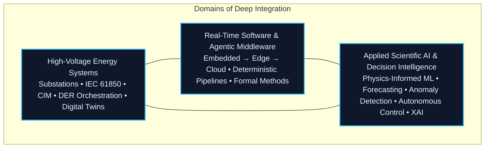

<p align="center">
  
</p>
<p align="center">
  <a href="https://vincenzo-grimaldi-portfolio.vercel.app/"></a>
  <a href="https://www.linkedin.com/in/vincenzo-ceccarelli-grimaldi-2912b42a0"></a>
  <a href="https://www.instagram.com/grimaldiengineering/"></a>
  <a href="https://x.com/Vince87Grimaldi"></a>
</p>
<p align="center">
  <strong>Designing deterministic, physics-informed intelligence that transforms complex control systems into operational, verifiable, and adaptive realities.</strong><br>
  <sub>High-Voltage Substations • Agentic Middleware • Autonomous Grid Intelligence • RTOS &amp; Verification</sub>
</p>

<!-- === PROFESSIONAL WORK DEMO === -->
<p align="center">
  
  <br>
  <sub><em>GridOS • Local‑first digital‑twin &amp; high‑voltage telemetry operating system</em></sub>
</p>
<!-- ================================= -->

## Brand Architecture

**Developer Surface** — This GitHub profile is the precision technical interface: engineered for systems architects, control engineers, platform teams, and researchers who require deep visibility into code, formal methods, architectural decisions, and implementation rigor.

**Executive Surface** — The [Immersive Portfolio](https://vincenzo-grimaldi-portfolio.vercel.app/) is the strategic narrative layer where physics-informed systems, interactive digital twins, live agentic intelligence, and cinematic visualization communicate the same mission to executives, regulators, investors, and ecosystem partners.

**Unified thesis. Complementary interfaces. Mission-aligned.**

## Executive Vision

The global energy transition has entered its decisive phase. Grids must simultaneously absorb record renewable penetration, electrified transport and heating loads, hyperscale data center demand, and extreme weather events — while withstanding increasingly sophisticated cyber threats and satisfying tightening regulatory mandates (NIS2, CRA, NERC CIP).

Traditional siloed approaches — separate OT systems, statistical ML models, and manual coordination — are reaching their physical and operational limits.

The organizations that will lead are those that deploy **unified, physics-constrained, agentic intelligence layers** capable of autonomous yet verifiable decision-making across the full stack: from substation IEDs and edge controllers to cloud orchestration and market participation.

I architect these foundational layers.

## Physics-Informed Intelligence: The Non-Negotiable Foundation

The most advanced autonomous and agentic systems achieve genuine operational trust only when machine intelligence is rigorously constrained by the laws of physics. In high-voltage environments, unconstrained models introduce unacceptable safety, regulatory, and financial risk.

**Core principle**: Data fidelity must be balanced with explicit physical consistency.

**Total objective**:
```math
L_{\text{total}} = L_{\text{data}} + \lambda L_{\text{physics}}
```

**Physics residual** (enforcing known dynamics):
```math
L_{\text{physics}} = \left\| \frac{\partial u}{\partial t} + \mathcal{N}[u] \right\|^2
```

This formulation is the bedrock of real-time, **provably consistent surrogate models** deployed in GridOS and NeuralBridge. The outcome is intelligence that is not only high-performing but **certifiable, auditable, and safe** for deployment in safety-critical high-voltage infrastructure.

This same foundation powers the live **[physics-informed](https://github.com/iceccarelli/physics-informed)** public simulator — the reference implementation of cross-domain CIM–ThreMA ontology integration, Physics-Informed Neural Networks, and reinforcement learning security methodology from the 2025 Master Thesis at RWTH Aachen University.

## Architecture of Value Creation

Four coherent, mutually reinforcing layers. One unified capability stack from silicon to strategy.

| Layer | Platform | Strategic Capability |
|-------|----------|----------------------|
| **Embedded Control & Real-Time Layer** | RTOS + Signal Integrity | Hard real-time kernels, deterministic scheduling, and formally verifiable bounded latency for SIL-rated safety functions in electrified rail and grid protection systems |
| **Grid Operating System Layer** | GridOS | High-fidelity digital command surface delivering observability, DER coordination, closed-loop autonomous control, and real-time digital twin synchronization for next-generation substations |
| **Agentic Orchestration Layer** | NeuralBridge | Deterministic middleware that safely bridges human operators, large language model agents, and physical actuators while preserving hard real-time guarantees and formal verifiability |
| **Autonomous Perception & Actuation Layer** | Robot LiDAR Fusion | Real-time multi-sensor fusion and perception pipelines that translate raw sensor data into verifiable physical actions for autonomous inspection robots in live high-voltage environments |

## Core Technology Domains

I operate daily at the convergence of three domains that collectively define the next generation of resilient, autonomous infrastructure.



High-voltage domain depth supplies the immutable physics constraints and regulatory reality.  
Software engineering delivers the high-assurance, verifiable skeleton.  
Applied Scientific AI injects adaptive, agentic intelligence — always grounded in operational physics, formal methods, and compliance requirements.

## Technology Stack & Contemporary Capabilities

Full-spectrum mastery from bare-metal RTOS and edge controllers to cloud-native platforms and immersive visualization — the precise stack required to digitize, secure, autonomize, and future-proof high-voltage assets in 2026 and beyond.

<p align="center">
  
</p>

**Capabilities this integrated stack delivers in production environments today:**

- **Real-time multi-protocol grid telemetry & semantic interoperability** — Native implementation of IEC 61850 (MMS, GOOSE, Sampled Values), DNP3, MODBUS TCP/RTU, MQTT Sparkplug B, OPC-UA, and full CIM semantic modeling for end-to-end digital thread continuity across OT and IT domains.
- **Agentic edge-to-cloud data fabrics & multi-agent orchestration** — High-throughput, low-latency streaming architectures (Kafka, NATS JetStream, RabbitMQ), industrial time-series databases (TimescaleDB, InfluxDB), and production-grade agentic middleware for autonomous DER coordination and grid-edge decisioning.
- **High-fidelity physics-informed digital twins & hardware-in-the-loop co-simulation** — Real-time surrogate modeling with Physics-Informed Neural Networks and neural operators, HELICS co-simulation, hardware-in-the-loop (HIL) testing environments, and immersive real-time 3D visualization (Three.js, Unity HDRP, Unreal Engine 5).
- **Edge-deployed Scientific AI for autonomous grid operations** — Physics-constrained probabilistic forecasting, real-time anomaly detection and containment, multi-agent reinforcement learning for optimal DER dispatch and Volt/VAR optimization, and online adaptive control under distribution shift and concept drift.
- **DevSecOps, Zero-Trust Architecture & Continuous Compliance for Critical Infrastructure** — GitOps with policy-as-code, immutable infrastructure, automated compliance evidence generation, and zero-trust networking patterns aligned to NERC CIP, NIS2, EU Cyber Resilience Act (CRA), and IEC 62351 — enabling secure, auditable, and regulator-ready deployments.

## Flagship Open-Source Platforms

All flagship repositories are open source. They are designed for inspection, extension, pilot deployment, and production use in mission-critical environments.

| Project | Focus Area | Maturity | Access |
|---------|------------|----------|--------|
| **[physics-informed](https://github.com/iceccarelli/physics-informed)** | Production-grade interactive simulator implementing cross-domain CIM + ThreMA ontology integration, Physics-Informed Neural Networks, reinforcement learning security agents, and complete IEEE 9-Bus cyber-physical validation framework (core deliverable of the 2025 RWTH Aachen Master Thesis) | Live Demo | [Launch Live Simulator](https://physics-informed.vercel.app/) |
| **[NeuralBridge](https://github.com/iceccarelli/neuralbridge)** | AI-native deterministic agentic middleware for safe, verifiable orchestration between human operators, large language models, and physical actuators in safety-critical cyber-physical systems | Active Development | [View Repository](https://github.com/iceccarelli/neuralbridge) |
| **[GridOS](https://github.com/iceccarelli/GridOS)** | Real-time grid operating system and control-oriented digital twin platform delivering high-fidelity observability, DER aggregation, and closed-loop autonomous intelligence for HV/MV substations | Under Active Construction | [View Repository](https://github.com/iceccarelli/GridOS) |
| **[DERIM](https://github.com/iceccarelli/derim-middleware)** | Distributed Energy Resource Intelligence Middleware with native multi-protocol modeling (IEC 61850 / DNP3), verifiable multi-agent coordination, and physics-informed optimization for high-renewable penetration scenarios | Active Development | [View Repository](https://github.com/iceccarelli/derim-middleware) |
| **[robot-lidar-fusion](https://github.com/iceccarelli/robot-lidar-fusion)** | Real-time LiDAR perception, multi-sensor fusion, and SLAM pipelines purpose-built for autonomous mobile inspection and maintenance robots operating in energized high-voltage substation environments | Active Development | [View Repository](https://github.com/iceccarelli/robot-lidar-fusion) |

**Star the repositories. Fork them. Deploy them in production. Build the future of critical infrastructure with them.**

## Engineering Philosophy & Delivery Model

I deliver **resilient, explainable, and formally verifiable systems** engineered to operate without compromise under the combined physical, cyber, and regulatory constraints of high-voltage transmission, distribution, and traction power networks.

- Architecture and interfaces designed from first principles around **safety, determinism, auditability, and regulatory alignment**
- Comprehensive verification & validation discipline including unit, integration, hardware-in-the-loop (HIL), and formal methods (TLA+) where system integrity demands it
- Incremental, risk-managed delivery of complete, independently testable subsystems accompanied by documentation that control-room operators and field engineers can actually use
- Strong preference for open standards, portable implementations, and architectures that remain viable across vendor ecosystems and technology generations

Primary implementation stack: **Python** for orchestration, data science, and rapid agent development; **Rust** and **C++** for performance-critical deterministic real-time cores; **FastAPI** for high-performance, type-safe APIs; combined with production real-time data pipelines and advanced digital twin engines. When executive or operator communication requires it, fluid frontends are delivered in **React/Next.js** or immersive 3D experiences via **Three.js** and **Unreal Engine**.

## Quantified Impact

Selected, validated outcomes from research prototypes, pilot systems, and production-adjacent deployments:

- **22% reduction** in renewable curtailment achieved through DERIM middleware coupled with multi-agent reinforcement learning dispatch optimization
- **Sub-8 ms** deterministic end-to-end orchestration latency demonstrated in NeuralBridge agentic layers under realistic multi-agent, multi-protocol workloads
- **99.999% uptime** architectural target enabled by RTOS foundations, physics-informed runtime verification, and proactive anomaly containment strategies
- **15–40% higher** renewable energy penetration enabled in validated simulation and pilot environments through physics-constrained autonomous Volt/VAR control and DER coordination intelligence

## Professional Experience

| Role | Organization | Period | Key Focus Areas |
|------|--------------|--------|-----------------|
| **ITk Fachspezialist – Digitisation of High‑Voltage Assets** | **DB InfraGO AG** | Aug 2024 – Present | Leading digitalization strategy and execution for railway traction high-voltage grids; driving IT/OT convergence programs; establishing cybersecurity governance frameworks and resilience engineering practices for critical infrastructure |
| **Industrial Engineering Intern – High‑Voltage Maintenance** | **DB Fahrzeuginstandhaltung GmbH & DB Netz AG** | Jun 2022 – Sep 2024 | Lifecycle management and condition-based maintenance of traction power substations; asset condition monitoring and health analytics; critical systems reliability and maintenance engineering |

## Standards, Regulatory Frameworks & Compliance Mastery

Operational, production-grade expertise in the standards and regulatory regimes that govern safe, secure, and interoperable critical energy and transport infrastructure worldwide:

**IEC 61850** • **CIM (IEC 61968/61970)** • **OCPP** • **SunSpec** • **ROS 2** • **HELICS** • **TLA+** • **IEC 62351** • **NERC CIP** • **NIS2** • **EU Cyber Resilience Act (CRA)**

## Language Proficiency

<p align="left">
  
  
  
  
</p>

## Open-Source Engineering Footprint

<p align="center">
  
</p>
<p align="center">
  
</p>

---

**Two Surfaces. One Mission.**

This README is the developer and technical deep-dive surface.

For the complete executive briefing experience — interactive physics-informed visualizers, live agentic digital twin demonstrations, and strategic narrative — visit:

**[https://igrimaldi.engineering/](https://igrimaldi.engineering/)**

**Vincenzo Grimaldi**

Architecting deterministic, physics-guaranteed intelligence for the critical infrastructure that powers the global net-zero transition.

📍 Europe-based • Selectively open to high-impact advisory, architectural, and leadership engagements in Cyber-Physical Systems, Grid Modernization, and Autonomous Infrastructure

✉️ [vincenzo@grimaldi.engineering](mailto:vincenzo@grimaldi.engineering)
