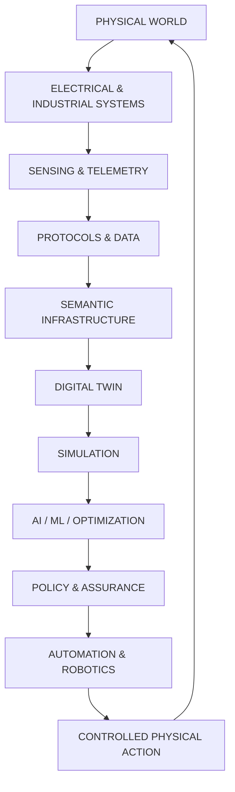
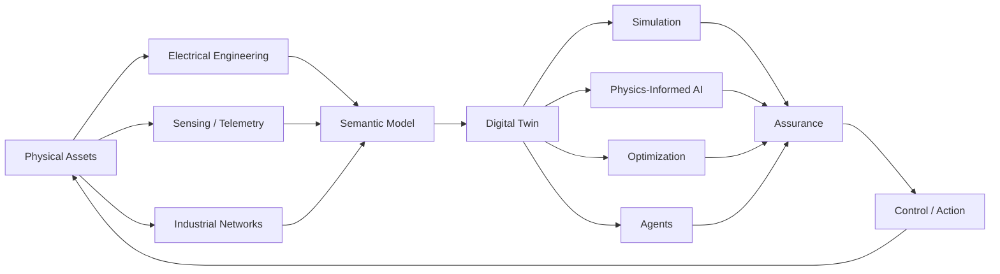
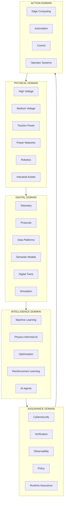
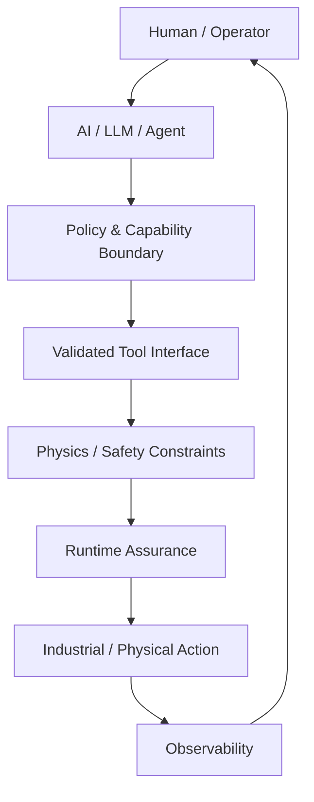
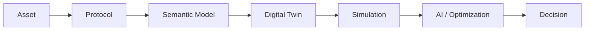
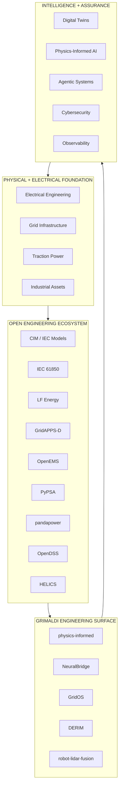
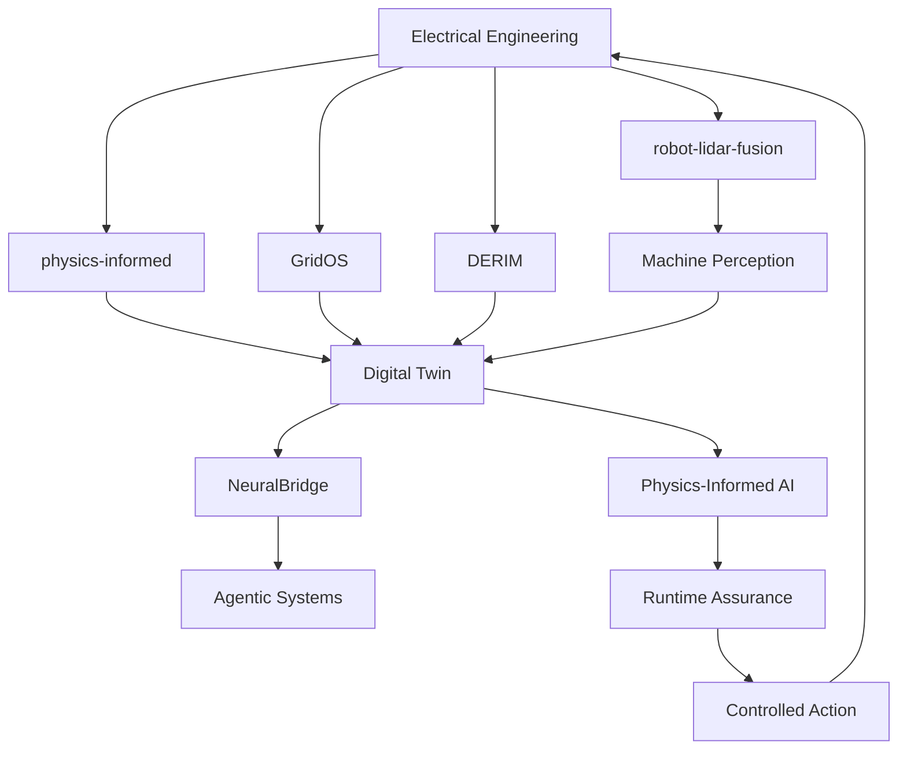
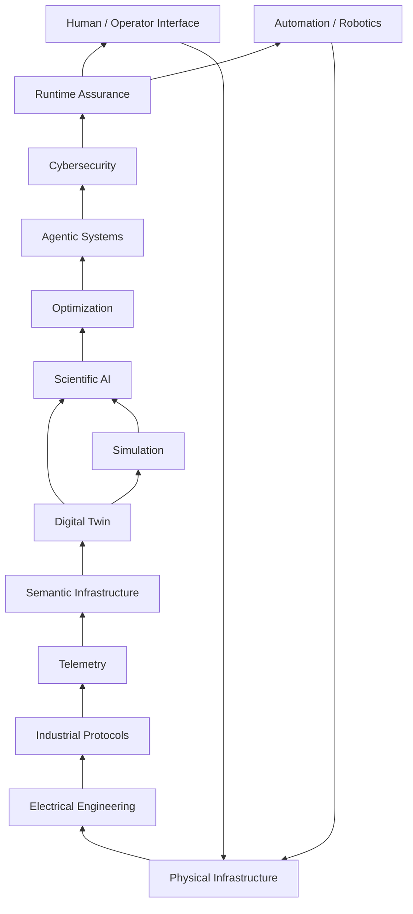
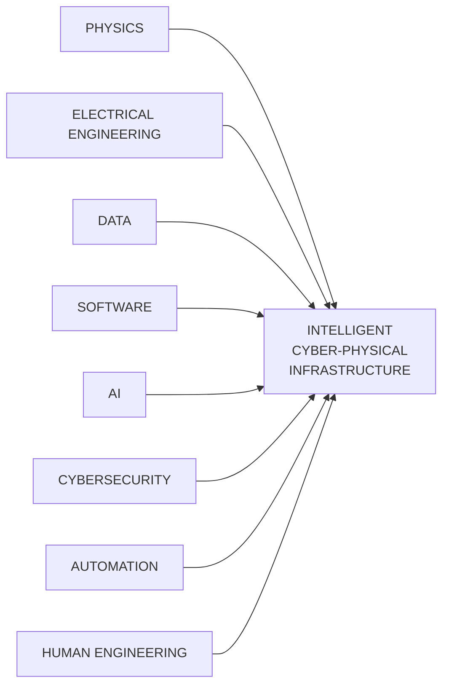

<p align="center">
  
</p>

<p align="center">

<a href="https://grimaldi.ca">
  
</a>

<a href="https://www.linkedin.com/in/vincenzo-ceccarelli-grimaldi-2912b42a0">
  
</a>

<a href="https://www.instagram.com/grimaldiengineering/">
  
</a>

<a href="https://x.com/Vince87Grimaldi">
  
</a>

<a href="mailto:Vincenzo.grimaldi.engineering@gmail.com">
  
</a>

</p>

<p align="center">
  <strong>
    PHYSICAL INFRASTRUCTURE → DATA → MODELS → INTELLIGENCE → ASSURANCE → ACTION
  </strong>
</p>

<p align="center">
  <sub>
    Electrical Engineering • Critical Infrastructure • Digital Twins • Physics-Informed AI • Industrial Systems • Robotics • OT Security
  </sub>
</p>

<p align="center">
  <sub>
    Building software-defined engineering systems for the physical world.
  </sub>
</p>

---

# VINCENZO GRIMALDI

### Cyber-Physical Systems Engineer · Digital Infrastructure Architect · Physics-Informed AI Engineer

I design and build software-defined infrastructure for complex physical systems.

The physical layer is the starting point.

Electrical infrastructure, power systems, traction systems, industrial assets, machines and networks become the foundation on which software, telemetry, semantic models, simulation, artificial intelligence, cybersecurity and autonomous systems are built.

The objective is not to create another disconnected software application.

It is to connect the layers.

```text
PHYSICAL INFRASTRUCTURE
        ↓
ELECTRICAL / INDUSTRIAL SYSTEMS
        ↓
SENSING + TELEMETRY
        ↓
PROTOCOLS + DATA
        ↓
SEMANTIC MODELS
        ↓
DIGITAL TWINS
        ↓
SIMULATION
        ↓
AI / ML / OPTIMIZATION
        ↓
POLICY + ASSURANCE
        ↓
AUTOMATION / ROBOTICS
        ↓
PHYSICAL ACTION
```

This repository is the engineering surface for that direction.

---

# THE SYSTEM

Modern infrastructure is no longer divided cleanly into hardware and software.

An electrical asset can simultaneously be:

* a physical machine
* a power-system component
* a real-time control system
* an industrial network endpoint
* a cybersecurity boundary
* a telemetry source
* a digital-twin object
* a machine-learning dataset
* an autonomous-agent environment
* an operational decision surface

The engineering problem is therefore not any single technology.

It is the integration between them.

---

# THE ENGINEERING THESIS



The loop is intentionally closed.

A useful engineering platform should not stop at visualization.

It should be capable of understanding state, modelling behaviour, testing scenarios, reasoning under constraints, producing decisions and connecting validated decisions back to operational systems.

---

# THE GRIMALDI ARCHITECTURE



### The architecture in one sentence

**Electrical and physical reality provide the constraints; software provides the representation; data provides observability; AI provides intelligence; assurance governs action.**

---

# 🌐 THE DIGITAL HOME

<p align="center">

<a href="https://grimaldi.ca">
  
</a>

</p>

**Grimaldi.ca** is the strategic and visual surface.

**GitHub** is the engineering surface.

Together they represent one engineering architecture:

```text
                         GRIMALDI.CA
                    Strategic / Visual Layer
                              │
                              ▼
                           GITHUB
                    Engineering Surface
                              │
          ┌───────────────────┼───────────────────┐
          ▼                   ▼                   ▼
       RESEARCH           SOFTWARE             SYSTEMS
          │                   │                   │
          └───────────────────┼───────────────────┘
                              ▼
                    CYBER-PHYSICAL SYSTEMS
                              │
             ┌────────────────┼────────────────┐
             ▼                ▼                ▼
          ENERGY             AI             ROBOTICS
             │                │                │
             └────────────────┼────────────────┘
                              ▼
                  INTELLIGENT INFRASTRUCTURE
```

---

# 🧭 THE ENGINEERING MAP

The portfolio is deliberately organized around a single stack rather than isolated specialties.



---

# 🌐 THE AUTHORITY MESH

The engineering surface is designed to connect into the broader open engineering ecosystem rather than existing as an isolated island.

### Energy Systems

* [LF Energy](https://lfenergy.org/) — open-source software, standards and data for energy infrastructure
* [GridAPPS-D](https://gridapps-d.org/) — open architecture for distribution-grid application development
* [OpenEMS](https://openems.io/) — modular open-source energy management
* [PyPSA](https://pypsa.org/) — power-system simulation and optimization
* [pandapower](https://pandapower.readthedocs.io/) — automated power-system analysis and optimization
* [OpenDSS](https://sourceforge.net/projects/electricdss/) — distribution-system simulation
* [HELICS](https://helics.org/) — co-simulation for interconnected energy systems

### Grid Intelligence

Selected adjacent ecosystems include:

* Grid2Op
* OpenGridFM
* SOGNO
* Power Grid Model
* PowSyBl
* Dynawo
* OperatorFabric
* DER interoperability tooling
* CIM-based data models
* IEC 61850 ecosystems

### Why the integration matters

The goal is not to recreate established infrastructure ecosystems.

The goal is to build engineering layers that can understand, connect, extend and operationalize them.

```text
OPEN STANDARDS
       │
       ▼
OPEN MODELS
       │
       ▼
OPEN SIMULATION
       │
       ▼
OPEN DATA
       │
       ▼
OPEN SOFTWARE
       │
       ▼
INTELLIGENT ENGINEERING SYSTEMS
```

The portfolio therefore remains compatible with the broader direction of open, modular and standards-based energy engineering.

---

# ⚡ CORE DOMAIN I — ELECTRICAL ENGINEERING

Electrical infrastructure forms the physical foundation of the system.

Areas of focus include:

* High-voltage substations
* Medium-voltage systems
* Railway traction power
* 16.7 Hz traction networks
* Protection and automation
* Condition monitoring
* Predictive maintenance
* Asset health
* Distributed Energy Resources
* Grid flexibility
* Renewable integration
* Grid constraints
* Reliability and resilience
* Digital substations
* Operational telemetry

The important transition is:

```text
Electrical Asset
      ↓
Electrical Model
      ↓
Digital Representation
      ↓
Observable System
      ↓
Intelligent System
```

---

# 🧠 CORE DOMAIN II — PHYSICS-INFORMED AI

Machine learning becomes considerably more useful for physical systems when the models understand the systems they are modelling.

Areas of interest include:

* Physics-Informed Neural Networks
* Neural Operators
* Fourier Neural Operators
* Scientific machine learning
* Hybrid physics / ML models
* State estimation
* Surrogate modelling
* Uncertainty quantification
* Probabilistic forecasting
* Distribution-shift detection
* Constrained optimization
* Reinforcement learning
* Multi-agent reinforcement learning
* Neuro-symbolic systems
* Explainable AI
* Runtime monitoring
* Safety constraints

### The principle

> AI should not replace engineering constraints.

> AI should operate inside them.

---

# 🤖 CORE DOMAIN III — AGENTIC CYBER-PHYSICAL SYSTEMS

The next generation of infrastructure will increasingly combine conventional automation with intelligent software agents.

The challenge is not merely making an agent capable of reasoning.

The challenge is making an agent capable of operating responsibly around physical systems.

That requires:

* Explicit capabilities
* Tool boundaries
* Deterministic interfaces
* Authentication
* Authorization
* Auditability
* Observability
* Runtime assurance
* Policy enforcement
* Human-in-the-loop escalation
* Physical constraints
* Fail-safe behaviour
* Reproducibility
* Cryptographic provenance



The target architecture is **controlled intelligence**, not uncontrolled autonomy.

---

# 🛰️ CORE DOMAIN IV — DIGITAL TWINS

A digital twin should move beyond static visualization.

A useful digital twin can combine:

```text
LIVE STATE
    ↓
TELEMETRY
    ↓
TOPOLOGY
    ↓
SEMANTIC MODELS
    ↓
PHYSICAL EQUATIONS
    ↓
SIMULATION
    ↓
PREDICTION
    ↓
OPTIMIZATION
    ↓
SCENARIO GENERATION
    ↓
OPERATOR INTERACTION
    ↓
CONTROLLED ACTION
```

This creates a progression:

```text
Digital Model
      ↓
Digital Twin
      ↓
Operational Digital Twin
      ↓
Intelligent Digital Twin
      ↓
Agentic Cyber-Physical System
```

---

# 🏗️ THE TECHNOLOGY STACK

## Systems & Languages

<p align="center">
  
</p>

Python · C · C++ · Rust · Go · Java · C# · Bash · PowerShell

Used across:

* Systems engineering
* Embedded development
* Scientific computing
* Real-time software
* Backend services
* Automation
* Data engineering
* Simulation
* AI / ML
* Infrastructure tooling

---

# 🌐 APPLICATION & PLATFORM ENGINEERING

<p align="center">
  
</p>

TypeScript · JavaScript · React · Next.js · Node.js · FastAPI · Flask · Django · HTML · CSS · Tailwind

Architecture patterns include:

* REST APIs
* Async services
* Event-driven backends
* WebSockets
* Streaming interfaces
* Distributed services
* API gateways
* Authentication and authorization
* Operational dashboards
* Engineering control surfaces

---

# 🧠 AI / ML / SCIENTIFIC COMPUTING

<p align="center">
  
</p>

PyTorch · TensorFlow · JAX · ONNX · NumPy · SciPy · Pandas · scikit-learn · OpenCV · Matplotlib · Plotly · Jupyter

Research and engineering interests:

* Deep learning
* Scientific ML
* PINNs
* Neural operators
* Computer vision
* Representation learning
* Time-series modelling
* Forecasting
* Anomaly detection
* Reinforcement learning
* Multi-agent systems
* Optimization
* Uncertainty quantification
* Digital-twin surrogate models

---

# ⚙️ REAL-TIME & EMBEDDED SYSTEMS

Real-world infrastructure imposes requirements that ordinary web software does not.

Relevant engineering areas include:

* RTOS
* Embedded Linux
* C / C++
* Rust
* Real-time scheduling
* Deterministic execution
* WCET analysis
* Interrupt-driven systems
* Memory safety
* IPC
* Device communication
* Hardware interfaces
* Signal processing
* Edge inference
* Hardware-in-the-loop testing
* Software-in-the-loop testing
* Functional safety concepts
* Runtime monitoring

The distinction matters:

```text
Fast            ≠ Deterministic
Low Latency     ≠ Guaranteed Latency
AI Accuracy     ≠ Operational Safety
```

Engineering systems have to consider all three dimensions together.

---

# ⚡ INDUSTRIAL PROTOCOLS & OT

Industrial interoperability is a foundational part of modern infrastructure.

| Technology                  | Domain                                |
| --------------------------- | ------------------------------------- |
| IEC 61850                   | Digital substations & protection      |
| MMS                         | IEC 61850 client/server communication |
| GOOSE                       | Fast substation event communication   |
| Sampled Values              | Digital measurement streams           |
| IEC 61850-90-x              | Extended grid communication models    |
| DNP3                        | Utility telemetry and control         |
| Modbus                      | Industrial equipment                  |
| OPC UA                      | Industrial interoperability           |
| MQTT                        | Lightweight telemetry                 |
| Sparkplug B                 | Industrial MQTT information model     |
| NATS                        | High-performance messaging            |
| Kafka                       | Distributed event streaming           |
| AMQP / RabbitMQ             | Message-oriented systems              |
| CIM / IEC 61968 / IEC 61970 | Utility semantic modelling            |
| HELICS                      | Energy-system co-simulation           |

The objective is not protocol collection.

It is interoperability across heterogeneous infrastructure.



---

# 🔐 CYBERSECURITY & RESILIENCE

Cybersecurity for physical infrastructure has consequences beyond ordinary software environments.

A compromise can affect:

```text
Confidentiality
      +
Integrity
      +
Availability
      +
Physical Safety
      +
System Stability
```

Areas of focus include:

* OT cybersecurity
* Zero-trust architecture
* Network segmentation
* Identity and access management
* Secure remote access
* PKI
* Certificate management
* Secure telemetry
* Cryptographic signing
* Supply-chain security
* SBOM
* Vulnerability management
* Threat modelling
* Security monitoring
* Runtime protection
* Incident response
* Resilience engineering

Relevant frameworks and standards include:

**IEC 62351 · IEC 62443 · NERC CIP · NIS2 · EU Cyber Resilience Act · MITRE ATT&CK for ICS**

---

# ☁️ EDGE → CLOUD INFRASTRUCTURE

Modern infrastructure requires computing everywhere.

```text
┌───────────────┐
│   PHYSICAL    │
│    ASSETS     │
└───────┬───────┘
        ↓
┌───────────────┐
│     EDGE      │
│   RT / AI /   │
│      OT       │
└───────┬───────┘
        ↓
┌───────────────┐
│   REGIONAL    │
│   SERVICES    │
└───────┬───────┘
        ↓
┌───────────────┐
│     CLOUD     │
│   DATA / ML   │
│      / AI     │
└───────┬───────┘
        ↓
┌───────────────┐
│   OPERATORS   │
│ & ENGINEERING │
└───────────────┘
```

<p align="center">
  
</p>

Docker · Kubernetes · Terraform · Ansible · Linux · AWS · Azure · GCP · NGINX

With emphasis on:

* Containerization
* Infrastructure as code
* GitOps
* Edge deployments
* Distributed services
* Observability
* Secrets management
* Automated testing
* Secure software supply chains
* Reproducible deployments

---

# 📡 DATA INFRASTRUCTURE

Physical systems generate enormous amounts of structured and unstructured data.

<p align="center">
  
</p>

PostgreSQL · TimescaleDB · InfluxDB · Redis · MongoDB · Neo4j · Cassandra · Kafka · RabbitMQ · NATS

Data patterns:

* Time-series databases
* Event sourcing
* Streaming architectures
* Graph databases
* Telemetry pipelines
* Digital-thread architectures
* Historical replay
* Event correlation
* Asset knowledge graphs
* Real-time feature pipelines

---

# 📊 OBSERVABILITY

Intelligent infrastructure needs to be observable at every layer.

```text
Infrastructure
      │
      ├── Logs
      ├── Metrics
      ├── Traces
      ├── Events
      ├── Telemetry
      ├── Model Predictions
      ├── Agent Actions
      └── Operator Decisions
               │
               ▼
      UNIFIED OBSERVABILITY
```

Technology ecosystem:

Prometheus · Grafana · OpenTelemetry · Elasticsearch · Loki · distributed tracing · structured logging

The objective is to make system behaviour explainable during operation and after the fact.

---

# 🧪 SIMULATION & CO-SIMULATION

Complex cyber-physical systems need environments where ideas can be tested before touching physical infrastructure.

Areas include:

* Power-system simulation
* Cyber-physical simulation
* Network simulation
* Agent-based simulation
* Reinforcement-learning environments
* Digital-twin simulation
* Hardware-in-the-loop
* Software-in-the-loop
* Scenario generation
* Contingency analysis
* Adversarial testing

Technology interests include:

**HELICS · OMNeT++ · RTDS · OPAL-RT · MATLAB / Simulink · Python scientific computing**

---

# 🦾 ROBOTICS & PERCEPTION

Physical infrastructure inspection creates another convergence point between AI and engineering.

Relevant areas include:

* LiDAR
* Computer vision
* Sensor fusion
* Point clouds
* SLAM
* Localization
* Object detection
* 3D reconstruction
* Uncertainty estimation
* ROS 2
* Autonomous navigation
* Path planning
* Robotic inspection
* Edge inference

<p align="center">
  
</p>

The broader objective:

**Enable machines to understand complex infrastructure well enough to inspect, monitor and assist with maintaining it.**

---

# 🌍 3D / VISUALIZATION / HUMAN INTERFACES

Engineering systems are ultimately operated by humans.

A technically powerful system becomes considerably more useful when its state can be understood immediately.

Technology interests:

Three.js · WebGL · WebGPU · Unity · Unreal Engine · Blender · Plotly · Dash · React

Applications include:

* 3D digital twins
* Substation visualization
* Asset visualization
* Network topology
* Live telemetry
* Simulation playback
* Operator dashboards
* Spatial interfaces
* Engineering visualization
* Interactive what-if analysis

---

# 🧩 SEMANTIC INFRASTRUCTURE

One of the largest problems in infrastructure is not the absence of data.

It is the absence of shared meaning.

The architecture therefore connects:

```text
Physical Asset
      ↓
Telemetry
      ↓
Protocol
      ↓
Semantic Model
      ↓
Digital Twin
      ↓
Simulation
      ↓
AI / Optimization
      ↓
Decision
```

Relevant technologies include:

**CIM · IEC 61968 · IEC 61970 · IEC 61850 · knowledge graphs · ontologies · RDF · graph databases · semantic APIs**

This creates a digital thread capable of surviving changes in vendors, protocols and software generations.

---

# 🏛️ ARCHITECTURE PRINCIPLES

## 01 — Physics over assumptions

Where physical laws are known, they should constrain computational models.

## 02 — Determinism where determinism matters

Critical paths should not depend on probabilistic behaviour when bounded behaviour is required.

## 03 — AI inside guardrails

Machine intelligence should operate within explicit physical, operational and security boundaries.

## 04 — Observable by design

If a system cannot explain what it is doing, diagnosing and governing it becomes unnecessarily difficult.

## 05 — Secure by architecture

Security should be structural rather than a final-stage feature.

## 06 — Open standards

Infrastructure should not become permanently dependent on a single vendor or proprietary abstraction.

## 07 — Human accountability

Automation should increase human capability rather than eliminate operational responsibility.

## 08 — Build for the physical world

Software architecture must ultimately respect:

**voltage · current · thermal limits · latency · mechanical constraints · electromagnetic environments · safety distances · failure modes**

---

# 🌐 THE INTEROPERABILITY LAYER

The projects here are designed to exist within a broader engineering landscape.



This is the important distinction:

**integration rather than reinvention.**

---

# 🚀 SELECTED ENGINEERING SYSTEMS

## ⚡ physics-informed

Physics-informed cyber-physical simulation and scientific-AI research environment.

Key areas:

* Physics-Informed Neural Networks
* Neural operators
* Cyber-physical simulation
* CIM integration
* Power-system modelling
* Reinforcement learning
* Adversarial scenarios
* IEEE benchmark systems
* Physics-constrained inference

Repository:

https://github.com/iceccarelli/physics-informed

Live environment:

https://physics-informed.vercel.app/

---

## 🧠 NeuralBridge

A research and engineering direction focused on deterministic middleware between intelligent software and cyber-physical environments.

```text
Human
  │
  ▼
AI / LLM / Agent
  │
  ▼
Policy Layer
  │
  ▼
Validation
  │
  ▼
Runtime Assurance
  │
  ▼
Physical System
```

Repository:

https://github.com/iceccarelli/neuralbridge

---

## ⚡ GridOS

A next-generation digital operating environment for intelligent electrical infrastructure.

Focus areas include:

* High-voltage telemetry
* Digital twins
* Grid observability
* DER coordination
* Real-time simulation
* Physics-informed intelligence
* Operator interfaces
* Autonomous decision support
* Cyber-physical resilience

Repository:

https://github.com/iceccarelli/GridOS

---

## 🔋 DERIM

Distributed Energy Resource Intelligence Middleware.

Focus areas:

* DER orchestration
* Industrial protocols
* Grid flexibility
* Distributed optimization
* Multi-agent coordination
* Physics-aware control
* Grid services

Repository:

https://github.com/iceccarelli/derim-middleware

---

## 🦾 robot-lidar-fusion

Research and engineering around LiDAR-based perception and sensor fusion for autonomous inspection.

Focus areas:

* LiDAR
* Sensor fusion
* Point-cloud processing
* Computer vision
* Uncertainty
* Autonomous inspection
* Robotics
* Safety-aware action planning

Repository:

https://github.com/iceccarelli/robot-lidar-fusion

---

# 🖥️ GridOS — ENGINEERING DEMONSTRATION

<p align="center">
  
  <br>
  <sub>
    <em>
      GridOS — digital-twin and intelligent infrastructure engineering environment
    </em>
  </sub>
</p>

---

# 🧠 THE PORTFOLIO GRAPH

The repositories are not intended to exist as isolated software projects.

They form a research and engineering graph.



This creates a portfolio-level development loop:

```text
PHYSICAL DOMAIN
      ↓
MODEL
      ↓
SIMULATE
      ↓
INTELLIGENCE
      ↓
ASSURE
      ↓
ACT
      ↓
MEASURE
      ↓
LEARN
      ↺
```

---

# 🔬 RESEARCH DIRECTION

The long-term engineering direction is the convergence of:

```text
                    PHYSICS
                       │
                       ▼
                 DIGITAL TWINS
                       │
              ┌────────┴────────┐
              ▼                 ▼
           AI / ML          SIMULATION
              │                 │
              └────────┬────────┘
                       ▼
                AGENTIC SYSTEMS
                       │
                       ▼
                RUNTIME ASSURANCE
                       │
                       ▼
                 CYBERSECURITY
                       │
                       ▼
             PHYSICAL INFRASTRUCTURE
```

This creates a different class of software:

> **software that understands the physical systems it operates around.**

---

# 🛡️ STANDARDS & ENGINEERING FRAMEWORKS

## Energy & Industrial

* IEC 61850
* IEC 61968
* IEC 61970
* IEC 62351
* IEC 62443
* DNP3
* Modbus
* OPC UA
* MQTT
* Sparkplug B
* CIM

## Safety & Systems Engineering

* EN 50126
* EN 50128
* EN 50129
* RAMS
* Functional safety concepts
* Hardware-in-the-loop
* Software-in-the-loop
* Model-based engineering
* Formal methods
* Runtime assurance

## Cybersecurity & Regulation

* NERC CIP
* NIS2
* EU Cyber Resilience Act
* MITRE ATT&CK for ICS
* Zero-trust architecture
* Secure software supply chains
* SBOM
* Policy-as-code

## Distributed & Simulation Systems

* Kubernetes
* Docker
* Terraform
* Kafka
* NATS
* RabbitMQ
* HELICS
* OMNeT++

---

# 🧰 ENGINEERING TOOLBOX

<p align="center">
  
</p>

### Programming

Python · C · C++ · Rust · Go · Java · C# · TypeScript · JavaScript

### Scientific & AI

PyTorch · TensorFlow · JAX · ONNX · NumPy · SciPy · Pandas · scikit-learn · OpenCV

### Web & APIs

React · Next.js · Node.js · FastAPI · Flask · Django · WebSockets · REST

### Data

PostgreSQL · TimescaleDB · InfluxDB · MongoDB · Redis · Neo4j · Kafka · NATS · RabbitMQ

### Infrastructure

Linux · Docker · Kubernetes · Terraform · Ansible · AWS · Azure · GCP

### Observability

Prometheus · Grafana · OpenTelemetry · Elasticsearch

### Engineering & Simulation

HELICS · OMNeT++ · RTDS · OPAL-RT · MATLAB / Simulink · ROS 2

### Visualization

Three.js · WebGPU · WebGL · Unity · Unreal Engine · Blender · Plotly · Dash

---

# 🧬 THE FULL STACK



---

# 📈 ENGINEERING SURFACE

```text
                  ┌─────────────────────┐
                  │     GRIMALDI.CA     │
                  │ Strategic / Visual  │
                  └──────────┬──────────┘
                             │
                             ▼
                  ┌─────────────────────┐
                  │      GITHUB         │
                  │ Engineering Surface │
                  └──────────┬──────────┘
                             │
              ┌──────────────┼──────────────┐
              ▼              ▼              ▼
          Research        Software       Systems
              │              │              │
              └──────────────┼──────────────┘
                             ▼
                    Cyber-Physical Systems
                             │
             ┌───────────────┼───────────────┐
             ▼               ▼               ▼
           Energy            AI            Robotics
             │               │               │
             └───────────────┼───────────────┘
                             ▼
                   Intelligent Infrastructure
```

---

# 🌍 EXTERNAL ECOSYSTEM CONNECTIONS

The engineering surface naturally intersects with multiple established communities and technical foundations.

### Power Systems & Grid Simulation

* PyPSA
* pandapower
* OpenDSS
* GridAPPS-D
* HELICS
* Grid2Op
* Dynawo
* Power Grid Model
* PowSyBl

### Open Energy Infrastructure

* LF Energy
* SOGNO
* OpenEMS
* OpenFMB-related architectures
* CIM
* IEC 61850 ecosystems

### AI & Grid Intelligence

* Grid foundation-model research
* Physics-informed machine learning
* Scientific machine learning
* Graph-based grid intelligence
* Reinforcement-learning environments
* Agentic decision support

### Cyber-Physical Engineering

* Digital twins
* Runtime assurance
* OT cybersecurity
* Functional safety
* Hardware-in-the-loop
* Software-in-the-loop
* Edge computing

The objective is a portfolio that can communicate with the engineering world around it.

---

# 🧭 FROM ASSET TO INTELLIGENCE

A physical asset should progressively become richer in digital representation.

```text
┌─────────────────────────────┐
│        PHYSICAL ASSET       │
└──────────────┬──────────────┘
               ↓
┌─────────────────────────────┐
│       ENGINEERING MODEL     │
└──────────────┬──────────────┘
               ↓
┌─────────────────────────────┐
│      TELEMETRY / DATA       │
└──────────────┬──────────────┘
               ↓
┌─────────────────────────────┐
│      SEMANTIC MODEL         │
└──────────────┬──────────────┘
               ↓
┌─────────────────────────────┐
│        DIGITAL TWIN         │
└──────────────┬──────────────┘
               ↓
┌─────────────────────────────┐
│   SIMULATION / PREDICTION   │
└──────────────┬──────────────┘
               ↓
┌─────────────────────────────┐
│      AI / OPTIMIZATION      │
└──────────────┬──────────────┘
               ↓
┌─────────────────────────────┐
│     ASSURANCE / POLICY      │
└──────────────┬──────────────┘
               ↓
┌─────────────────────────────┐
│       CONTROL / ACTION      │
└─────────────────────────────┘
```

---

# ⚙️ WHAT IS BEING BUILT

Not simply:

* another AI application
* another dashboard
* another digital-twin visualization
* another grid simulator
* another automation framework
* another robotics repository

The larger engineering direction is the integration of all of them.

```text
              PHYSICS
                 │
                 ▼
          ELECTRICAL SYSTEM
                 │
                 ▼
        DIGITAL REPRESENTATION
                 │
                 ▼
          DIGITAL TWIN
                 │
          ┌──────┴──────┐
          ▼             ▼
       SIMULATION       DATA
          │             │
          └──────┬──────┘
                 ▼
           AI / ML / RL
                 │
                 ▼
         POLICY + ASSURANCE
                 │
                 ▼
          CONTROLLED ACTION
                 │
                 ▼
        PHYSICAL INFRASTRUCTURE
```

---

# 🧠 THE BIGGER PICTURE

The future of infrastructure will not be defined by AI alone.

It will be defined by the integration of:

**Physics + Electrical Engineering + Software + Data + AI + Cybersecurity + Automation + Human Engineering**

The systems worth building are those that can operate across these domains without losing the properties that make physical infrastructure trustworthy:

**determinism · safety · resilience · observability · interoperability · explainability · accountability**

That is the engineering problem this portfolio is designed to explore.

---

# 🔭 THE NORTH STAR



The objective is not to remove the engineering discipline beneath the software.

It is to make that discipline computable.

---

# 🔗 CONNECT

<p align="center">

<a href="https://grimaldi.ca">
  
</a>

<a href="https://www.linkedin.com/in/vincenzo-ceccarelli-grimaldi-2912b42a0">
  
</a>

<a href="mailto:Vincenzo.grimaldi.engineering@gmail.com">
  
</a>

</p>

---

# 🇬🇧 🇩🇪 🇪🇸 🇨🇳 LANGUAGES

English · German · Spanish · Mandarin

---

<p align="center">

<strong>Vincenzo Grimaldi</strong>

<br>

<sub>
Cyber-Physical Systems · Electrical Engineering · Critical Infrastructure · Digital Twins · Physics-Informed AI · Intelligent Engineering
</sub>

<br><br>

<a href="https://grimaldi.ca">grimaldi.ca</a>
· <a href="mailto:Vincenzo.grimaldi.engineering@gmail.com">[Vincenzo.grimaldi.engineering@gmail.com](mailto:Vincenzo.grimaldi.engineering@gmail.com)</a>

</p>
