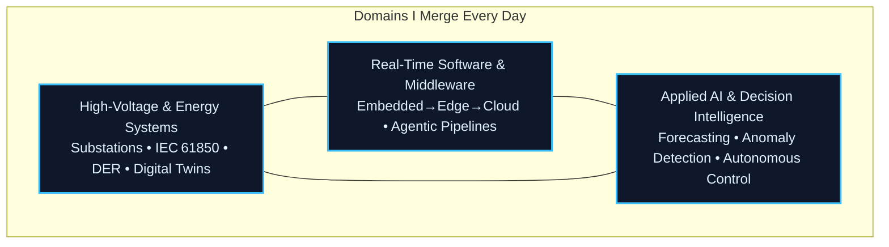

  

  
  
  

  <strong>Engineering the digital core of tomorrow’s energy infrastructure — from high‑voltage substations to agentic grid intelligence.</strong>

<!-- === PROFESSIONAL WORK DEMO === -->

  
   
  <em>GridOS • Local‑first digital‑twin &amp; high‑voltage telemetry operating system</em>

<!-- ================================= -->

## About Me

I operate at the convergence of **high‑voltage power engineering**, **real‑time software systems**, and **applied artificial intelligence**. My foundation is a degree in Business Administration and Engineering from **RWTH Aachen University**, with a deep specialization in Electrical Power Engineering.

I believe that the most advanced technical systems only create real value when they are **understandable, testable, and operational in the real world**. I focus on the **complete digitization of high‑voltage assets** — from substation automation and telemetry normalisation (IEC 61850, DNP3, MODBUS) to digital twins that faithfully mirror the physical grid, and AI pipelines that turn massive streams of operational data into autonomous, safe decisions.

## Core Focus

This diagram captures how I build: **high‑voltage domain depth** provides the physics, **software engineering** delivers the robust skeleton, and **applied AI** injects the intelligence — all grounded in the operational reality of critical infrastructure.

### Daily‑Driver Technology Landscape

I master and integrate the following stack across cloud, edge, and bare‑metal environments — the same stack that digitises high‑voltage assets end‑to‑end:

  

**What this stack unlocks every day:**  

- **Real‑time grid telemetry** — IEC 61850 MMS/GOOSE, DNP3, MODBUS TCP/RTU, MQTT Sparkplug, OPC‑UA  
- **Edge‑to‑cloud data fabrics** — streaming architectures (Kafka, NATS, RabbitMQ), time‑series databases (TimescaleDB, InfluxDB), agentic middleware  
- **Digital twins & co‑simulation** — physics‑informed models, hardware‑in‑the‑loop (HIL), real‑time 3D visualisation (Three.js, Unity, Unreal)  
- **AI/ML at the grid edge** — forecasting, anomaly detection, autonomous Volt/VAR control, reinforcement learning for DER dispatch  
- **DevOps for critical infrastructure** — GitOps, immutable infrastructure, zero‑trust security, automated compliance  

## Selected Projects

| Project | Focus | Maturity |
|---------|-------|----------|
| **[NeuralBridge](https://github.com/iceccarelli/neuralbridge)** | Agentic integration layer connecting AI workflows to physical grid devices via clean adapters | Active Development |
| **[GridOS](https://github.com/iceccarelli/GridOS)** | Local‑first high‑voltage digital‑twin OS with substation‑grade telemetry and real‑time simulation | Under Construction |
| **[DERIM](https://github.com/iceccarelli/derim-middleware)** | Open‑source middleware for solar, BESS, EV chargers — native IEC 61850/DNP3 modelling | Active Development |
| **[robot-lidar-fusion](https://github.com/iceccarelli/robot-lidar-fusion)** | Foundation for autonomous inspection robots: LiDAR‑camera fusion, perception, real‑time navigation | Active Development |

## How I Work

I ship **resilient, explainable systems** that function under the constraints of high‑voltage environments — where a misstep isn’t an option. My approach:

- Architecture that respects **safety, reliability, and real‑time requirements**
- Explicit interfaces and **comprehensive testing** (unit, integration, hardware‑in‑the‑loop)
- **Incremental delivery** of complete subsystems rather than over‑promised monoliths
- Documentation that an operator in a control room can actually use

My core tools are **Python, Rust, C++, FastAPI, real‑time data pipelines, and digital twin engines** — and when a project calls for it, I build fluid frontends with **React/Next.js** or 3D dashboards with **Three.js/Unreal**.

## Professional Experience

| Role | Organisation | Period | Focus |
|------|--------------|--------|-------|
| **ITk Fachspezialist – Digitisation of High‑Voltage Assets** | **DB InfraGO AG** | Aug 2024 – Present | Leading digitalisation strategy for railway traction HV grids; IT/OT convergence, cybersecurity governance, resilience engineering |
| **Industrial Engineering Intern – High‑Voltage Maintenance** | **DB Fahrzeuginstandhaltung GmbH & DB Netz AG** | Jun 2022 – Sep 2024 | Lifecycle management of traction power substations, asset condition monitoring, critical systems maintenance |

## Languages

  
  
  
  

## GitHub Activity

  

  

