<p align="center">
  
</p>

<p align="center">

<a href="https://grimaldi.ca">
  
</a>

<a href="https://www.linkedin.com/in/vincenzo-ceccarelli-grimaldi-2912b42a0">
  
</a>

<a href="https://www.instagram.com/grimaldiengineering/">
  
</a>

<a href="https://x.com/Vince87Grimaldi">
  
</a>

<a href="mailto:Vincenzo.grimaldi.engineering@gmail.com">
  
</a>

</p>

<p align="center">
  <strong>PHYSICAL INFRASTRUCTURE → DATA → MODELS → INTELLIGENCE → ASSURANCE → ACTION</strong>
</p>

<p align="center">
  <sub>
    Electrical Engineering • Critical Infrastructure • Digital Twins • Physics-Informed AI • Industrial Systems • Robotics • OT Security
  </sub>
</p>

<p align="center">
  <sub>
    Software-defined engineering for systems that exist in the physical world.
  </sub>
</p>

---

# VINCENZO GRIMALDI

### Cyber-Physical Systems Engineer · Digital Infrastructure Architect · Physics-Informed AI Engineer

I design and build software-defined infrastructure for complex physical systems.

The physical layer is the starting point.

Electrical infrastructure, power systems, traction systems, industrial assets, machines and networks become the foundation on which software, telemetry, semantic models, simulation, artificial intelligence, cybersecurity and autonomous systems are built.

The central problem is not another isolated application.

It is **integration**.

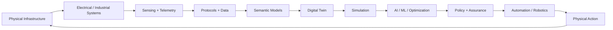

---

# THE ONE-SCREEN MAP

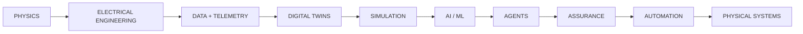

### The architecture in one sentence

**Electrical and physical reality provide the constraints; software provides the representation; data provides observability; AI provides intelligence; assurance governs action.**

---

# 2026 FRONTIER

The portfolio is positioned around several of the most active technical directions now emerging across power-system engineering and critical infrastructure.

| Frontier                                     | Current direction                                                                                          | Engineering implication                                                                      |
| -------------------------------------------- | ---------------------------------------------------------------------------------------------------------- | -------------------------------------------------------------------------------------------- |
| **Grid Foundation Models**                   | Large-scale AI models for power-system planning, scenario generation and decision support                  | Grid models are moving beyond isolated predictors toward reusable computational intelligence |
| **Graph + Time-Series Grid AI**              | Models combining network topology, time-series behaviour and generative methods                            | Infrastructure AI increasingly needs both structure and dynamics                             |
| **Agentic Grid Operations**                  | AI agents are being tested for operator assistance, recommendations and workflow integration               | Agents need simulation, policy boundaries, explainability and human oversight                |
| **Digital Substations**                      | IEC 61850 continues evolving, including newer 2026 material and power-system modelling work                | Interoperability and semantic infrastructure remain foundational                             |
| **DER Intelligence**                         | Storage, controllable loads, aggregations and distributed resources require richer machine-readable models | Grid software increasingly operates on fleets rather than individual assets                  |
| **AI Assurance for Critical Infrastructure** | Formal work is emerging around trustworthy AI, determinism, resilience and graceful degradation            | "AI capability" is becoming inseparable from assurance architecture                          |
| **Open Energy Infrastructure**               | Open-source projects are advancing from experimentation toward production and ecosystem integration        | Interoperability becomes an engineering strategy rather than a documentation exercise        |

Examples include DOE's 2026 GridFM 2.0 project targeting vastly higher grid-scenario throughput; DOE/LLNL's Stormbreaker testbed for LLM and agentic-AI evaluation in power/OT environments; GE Vernova's active Dynamic Grid Foundation Model project; LF Energy's AINETUS, Grid2Op and OpenGridFM activities; NIST's ongoing trustworthy-AI profile for critical infrastructure; and the 2026 IEC 61850 series release.
[DOE GridFM 2.0](https://www.energy.gov/oe/articles/does-office-electricity-announces-115m-genesis-mission-project-meet-growing-electricity) · [DOE Stormbreaker](https://www.energy.gov/ceser/articles/ceser-releases-new-testbed-advance-llm-and-agentic-ai-evaluation-critical) · [GE Vernova DynaGridFM](https://arpa-e.energy.gov/programs-and-initiatives/search-all-projects/dynamic-grid-foundation-model-based-rapid-decision-support-fully-dynamic-grid) · [LF Energy AINETUS](https://lfenergy.org/projects/ainetus/) · [NIST Critical Infrastructure AI](https://www.nist.gov/programs-projects/concept-note-ai-rmf-profile-trustworthy-ai-critical-infrastructure) · [IEC 61850:2026](https://webstore.iec.ch/en/publication/6028)

---

# THE SYSTEM

Modern infrastructure is no longer divided cleanly into hardware and software.

An electrical asset can simultaneously be:

**physical machine · power-system component · real-time system · OT endpoint · cybersecurity boundary · telemetry source · digital-twin object · ML dataset · agent environment · operational decision surface**

The engineering objective is therefore:

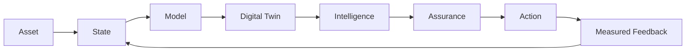

The loop is intentionally closed.

A useful platform should not stop at visualization.

It should be capable of:

**observe → model → simulate → predict → optimize → assure → act → measure → learn**

---

# THE GRIMALDI ARCHITECTURE

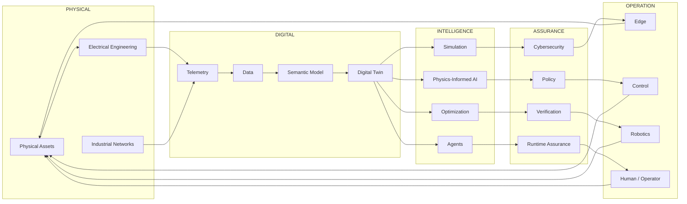

---

# 🌐 THE DIGITAL HOME

<p align="center">
  <a href="https://grimaldi.ca">
    
  </a>
</p>

**Grimaldi.ca** is the strategic and visual surface.

**GitHub** is the engineering surface.

Together:

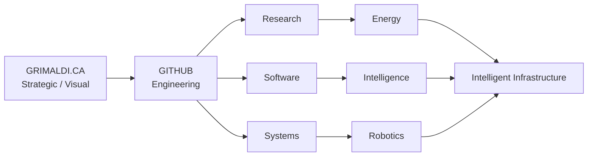

---

# 🧭 ENGINEERING MAP

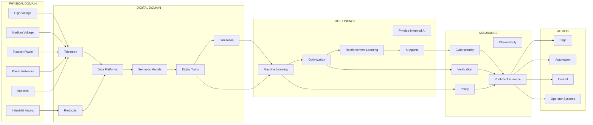

---

# 🌐 AUTHORITY MESH

The engineering surface is designed to connect with the broader open engineering ecosystem rather than exist as an isolated island.

### ENERGY / GRID

**LF Energy · GridAPPS-D · OpenEMS · PyPSA · pandapower · OpenDSS · HELICS**

### GRID INTELLIGENCE

**Grid2Op · OpenGridFM · AINETUS · SOGNO · Power Grid Model · PowSyBl · Dynawo · OperatorFabric**

### STANDARDS

**IEC 61850 · CIM · IEC 61968 · IEC 61970 · IEC 62351 · IEC 62443**

### PHYSICS / SIMULATION

**HELICS · RTDS · OPAL-RT · MATLAB/Simulink · OMNeT++ · scientific Python**

### CYBER-PHYSICAL

**Digital Twins · Runtime Assurance · OT Security · Functional Safety · HIL · SIL · Edge Computing**

The goal is not to duplicate established ecosystems.

It is to build the engineering layers that connect them.

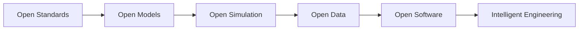

LF Energy's 2026 ecosystem activity is particularly relevant here: AINETUS is explicitly designed to integrate with Grid2Op, OperatorFabric and SOGNO; Grid2Op and OpenGridFM moved toward Incubation; SEAPATH reached Graduation; and additional projects are expanding AI, DER interoperability and operational tooling.

---

# ⚡ ELECTRICAL ENGINEERING

Electrical infrastructure forms the physical foundation.

<details>
<summary><strong>Domains</strong></summary>

* High-voltage substations
* Medium-voltage systems
* Railway traction power
* 16.7 Hz traction networks
* Protection and automation
* Condition monitoring
* Predictive maintenance
* Asset health
* Distributed Energy Resources
* Grid flexibility
* Renewable integration
* Grid constraints
* Reliability and resilience
* Digital substations
* Operational telemetry

</details>

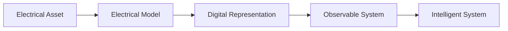

### CURRENT FRONTIER

Modern electrical-system software is increasingly moving toward:

**digital substations → DER-aware semantic models → grid-forming / inverter-dominated systems → real-time operational data → AI-assisted planning and operations → validated decision support**

IEC's 2026 IEC 61850 series includes new material such as IEC 61850-7-410:2026, while IEC 61850-7-420:2021 provides information models for DER and distribution automation.

---

# 🧠 PHYSICS-INFORMED AI

Machine intelligence becomes more useful for physical systems when it understands the systems it is modelling.

<details>
<summary><strong>Research surface</strong></summary>

* Physics-Informed Neural Networks
* Neural Operators
* Fourier Neural Operators
* Scientific Machine Learning
* Hybrid Physics / ML
* State Estimation
* Surrogate Modelling
* Uncertainty Quantification
* Probabilistic Forecasting
* Distribution-Shift Detection
* Constrained Optimization
* Reinforcement Learning
* Multi-Agent Reinforcement Learning
* Neuro-Symbolic Systems
* Explainable AI
* Runtime Monitoring
* Safety Constraints

</details>

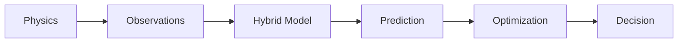

### PRINCIPLE

> **AI should not replace engineering constraints.**
>
> **AI should operate inside them.**

### CURRENT FRONTIER

A major current direction is the combination of:

**foundation models + graph structure + time-series data + physical constraints + simulation + uncertainty + operator workflows**

DOE's September 2026 GridFM 2.0 initiative is explicitly pursuing large-scale foundation-model approaches for grid planning and expansion, while an active GE Vernova/Georgia Tech/PNNL project is developing a Dynamic Grid Foundation Model using generative AI, time-series modelling and graph neural networks.

---

# 🤖 AGENTIC CYBER-PHYSICAL SYSTEMS

The interesting problem is not simply whether an AI system can reason.

It is whether the system can reason **inside a governed engineering environment**.

<details>
<summary><strong>Required boundaries</strong></summary>

* Explicit capabilities
* Tool boundaries
* Deterministic interfaces
* Authentication
* Authorization
* Auditability
* Observability
* Runtime assurance
* Policy enforcement
* Human-in-the-loop escalation
* Physical constraints
* Fail-safe behaviour
* Reproducibility
* Cryptographic provenance

</details>

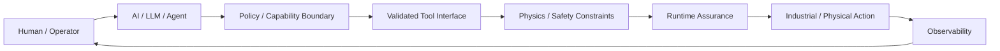

### CURRENT FRONTIER

Agentic AI is moving into dedicated critical-infrastructure test environments rather than remaining purely a conversational technology.

DOE and Lawrence Livermore's 2026 Stormbreaker testbed is specifically designed to evaluate LLMs and agentic AI in power-system and OT environments. LF Energy's AINETUS similarly places AI decision support inside an established simulation and operator ecosystem instead of treating the agent as a standalone application.

---

# 🛰️ DIGITAL TWINS

A digital twin should move beyond static visualization.

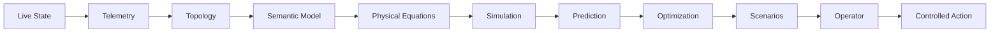

### PROGRESSION

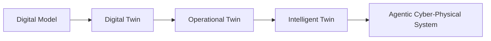

### CURRENT FRONTIER

The strongest digital-twin architectures are converging with:

**live operational state + communications + controls + simulation + AI + security + decision support**

Digital-twin work in critical infrastructure is therefore increasingly about dynamic operational models rather than 3D visualization alone. DOE research programs and recent utility-AI initiatives reflect this shift.

---

# 🏗️ TECHNOLOGY STACK

<details>
<summary><strong>Systems & Languages</strong></summary>

<p align="center">
  
</p>

Python · C · C++ · Rust · Go · Java · C# · Bash · PowerShell

Systems engineering · Embedded development · Scientific computing · Real-time software · Backend services · Automation · Data engineering · Simulation · AI/ML · Infrastructure tooling

</details>

<details>
<summary><strong>Application & Platform Engineering</strong></summary>

<p align="center">
  
</p>

TypeScript · JavaScript · React · Next.js · Node.js · FastAPI · Flask · Django · HTML · CSS · Tailwind

REST APIs · Async services · Event-driven backends · WebSockets · Streaming · Distributed services · API gateways · Authentication · Authorization · Dashboards · Engineering control surfaces

</details>

<details>
<summary><strong>AI / ML / Scientific Computing</strong></summary>

<p align="center">
  
</p>

PyTorch · TensorFlow · JAX · ONNX · NumPy · SciPy · Pandas · scikit-learn · OpenCV · Matplotlib · Plotly · Jupyter

Deep learning · Scientific ML · PINNs · Neural operators · Computer vision · Representation learning · Time-series · Forecasting · Anomaly detection · Reinforcement learning · Multi-agent systems · Optimization · Uncertainty quantification · Digital-twin surrogate models

</details>

<details>
<summary><strong>Real-Time & Embedded</strong></summary>

RTOS · Embedded Linux · C/C++ · Rust · Real-time scheduling · Deterministic execution · WCET analysis · Interrupt-driven systems · Memory safety · IPC · Device communication · Hardware interfaces · Signal processing · Edge inference · HIL · SIL · Functional safety · Runtime monitoring

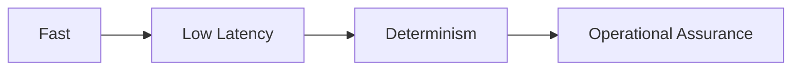

**Fast ≠ Deterministic · Low Latency ≠ Guaranteed Latency · AI Accuracy ≠ Operational Safety**

</details>

---

# ⚡ INDUSTRIAL PROTOCOLS & OT

| Technology                  | Engineering domain                |
| --------------------------- | --------------------------------- |
| IEC 61850                   | Digital substations & protection  |
| MMS                         | IEC 61850 client/server           |
| GOOSE                       | Fast substation events            |
| Sampled Values              | Digital measurement streams       |
| IEC 61850-90-x              | Extended grid communication       |
| DNP3                        | Utility telemetry and control     |
| Modbus                      | Industrial equipment              |
| OPC UA                      | Industrial interoperability       |
| MQTT                        | Telemetry                         |
| Sparkplug B                 | Industrial MQTT information model |
| NATS                        | High-performance messaging        |
| Kafka                       | Distributed event streaming       |
| AMQP / RabbitMQ             | Message-oriented systems          |
| CIM / IEC 61968 / IEC 61970 | Utility semantic modelling        |
| HELICS                      | Energy-system co-simulation       |

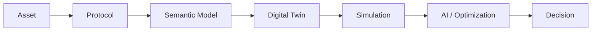

The objective is not protocol collection.

It is interoperability across heterogeneous infrastructure.

---

# 🔐 CYBERSECURITY & RESILIENCE

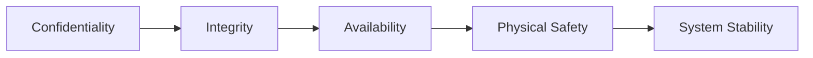

<details>
<summary><strong>Security surface</strong></summary>

OT cybersecurity · Zero-trust architecture · Network segmentation · IAM · Secure remote access · PKI · Certificate management · Secure telemetry · Cryptographic signing · Supply-chain security · SBOM · Vulnerability management · Threat modelling · Security monitoring · Runtime protection · Incident response · Resilience engineering

</details>

### Relevant frameworks

**IEC 62351 · IEC 62443 · NERC CIP · NIS2 · EU Cyber Resilience Act · MITRE ATT&CK for ICS**

### CURRENT FRONTIER

AI assurance for critical infrastructure is becoming a first-class engineering concern. NIST's 2026 Trustworthy AI in Critical Infrastructure work explicitly addresses AI systems operating at the intersection of AI, IT, OT, ICS, cybersecurity and physical infrastructure, including deterministic behaviour, explainability, graceful degradation and fail-safe operation.

---

# ☁️ EDGE → CLOUD

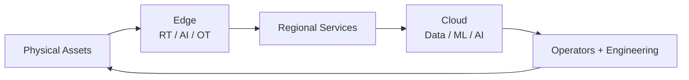

<p align="center">
  
</p>

Docker · Kubernetes · Terraform · Ansible · Linux · AWS · Azure · GCP · NGINX

Containerization · Infrastructure as Code · GitOps · Edge deployments · Distributed services · Observability · Secrets management · Automated testing · Secure supply chains · Reproducible deployments

---

# 📡 DATA INFRASTRUCTURE

<p align="center">
  
</p>

PostgreSQL · TimescaleDB · InfluxDB · Redis · MongoDB · Neo4j · Cassandra · Kafka · RabbitMQ · NATS

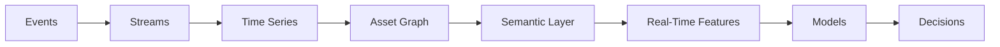

Time-series databases · Event sourcing · Streaming architectures · Graph databases · Telemetry pipelines · Digital-thread architectures · Historical replay · Event correlation · Asset knowledge graphs · Real-time feature pipelines

---

# 📊 OBSERVABILITY

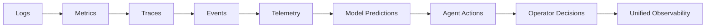

Prometheus · Grafana · OpenTelemetry · Elasticsearch · Loki · distributed tracing · structured logging

The objective:

**make system behaviour observable during operation and explainable after the fact.**

---

# 🧪 SIMULATION & CO-SIMULATION

Complex cyber-physical systems need environments where ideas can be tested before touching physical infrastructure.

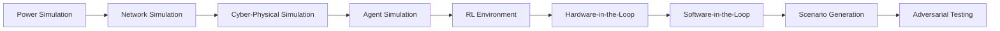

**HELICS · OMNeT++ · RTDS · OPAL-RT · MATLAB/Simulink · Python scientific computing**

Power-system simulation · Cyber-physical simulation · Network simulation · Agent-based simulation · RL environments · Digital twins · HIL · SIL · contingency analysis

---

# 🦾 ROBOTICS & PERCEPTION

Research and engineering around LiDAR-based perception and autonomous inspection.

<p align="center">
  
</p>

LiDAR · Computer vision · Sensor fusion · Point clouds · SLAM · Localization · Object detection · 3D reconstruction · Uncertainty estimation · ROS 2 · Autonomous navigation · Path planning · Robotic inspection · Edge inference

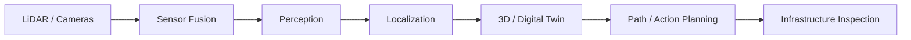

---

# 🌍 3D / VISUALIZATION / HUMAN INTERFACES

Technology interests:

**Three.js · WebGL · WebGPU · Unity · Unreal Engine · Blender · Plotly · Dash · React**

```mermaid
flowchart LR
    ASSET[Asset] --> STATE[Live State] --> 3D[3D View] --> TELEMETRY[Telemetry] --> SIM[Simulation] --> WHATIF[What-If Analysis] --> OPERATOR[Operator Interface]
```

Applications:

3D digital twins · Substation visualization · Asset visualization · Network topology · Live telemetry · Simulation playback · Operator dashboards · Spatial interfaces · Engineering visualization · Interactive what-if analysis

---

# 🧩 SEMANTIC INFRASTRUCTURE

One of the largest infrastructure problems is not missing data.

It is missing shared meaning.

```mermaid
flowchart LR
    ASSET[Physical Asset] --> TELEMETRY[Telemetry] --> PROTOCOL[Protocol] --> MODEL[Semantic Model] --> TWIN[Digital Twin] --> SIM[Simulation] --> AI[AI / Optimization] --> DECISION[Decision]
```

Relevant technologies:

**CIM · IEC 61968 · IEC 61970 · IEC 61850 · knowledge graphs · ontologies · RDF · graph databases · semantic APIs**

The target is a digital thread capable of surviving vendors, protocols and software generations.

---

# 🏛️ ARCHITECTURE PRINCIPLES

| #  | Principle                        | Meaning                                                                                |
| -- | -------------------------------- | -------------------------------------------------------------------------------------- |
| 01 | **Physics over assumptions**     | Known physical laws should constrain computational models                              |
| 02 | **Determinism where it matters** | Critical paths should have bounded behaviour where required                            |
| 03 | **AI inside guardrails**         | Intelligence operates inside explicit boundaries                                       |
| 04 | **Observable by design**         | Systems should expose enough state to diagnose and govern them                         |
| 05 | **Secure by architecture**       | Security is structural, not an afterthought                                            |
| 06 | **Open standards**               | Infrastructure should remain interoperable                                             |
| 07 | **Human accountability**         | Automation should increase capability without removing responsibility                  |
| 08 | **Build for the physical world** | Software must respect electrical, mechanical, thermal, temporal and safety constraints |

---

# 🚀 SELECTED ENGINEERING SYSTEMS

<details>
<summary><strong>⚡ physics-informed</strong></summary>

Physics-informed cyber-physical simulation and scientific-AI research environment.

**Key areas**

Physics-Informed Neural Networks · Neural operators · Cyber-physical simulation · CIM integration · Power-system modelling · Reinforcement learning · Adversarial scenarios · IEEE benchmark systems · Physics-constrained inference

**Repository**

https://github.com/iceccarelli/physics-informed

**Live environment**

https://physics-informed.vercel.app/

</details>

<details>
<summary><strong>🧠 NeuralBridge</strong></summary>

A research and engineering direction focused on deterministic middleware between intelligent software and cyber-physical environments.

```mermaid
flowchart LR
    HUMAN[Human] --> AGENT[AI / LLM / Agent] --> POLICY[Policy Layer] --> VALIDATE[Validation] --> ASSURE[Runtime Assurance] --> PHYSICAL[Physical System]
```

**Repository**

https://github.com/iceccarelli/neuralbridge

</details>

<details>
<summary><strong>⚡ GridOS</strong></summary>

A next-generation digital operating environment for intelligent electrical infrastructure.

High-voltage telemetry · Digital twins · Grid observability · DER coordination · Real-time simulation · Physics-informed intelligence · Operator interfaces · Autonomous decision support · Cyber-physical resilience

**Repository**

https://github.com/iceccarelli/GridOS

</details>

<details>
<summary><strong>🔋 DERIM</strong></summary>

Distributed Energy Resource Intelligence Middleware.

DER orchestration · Industrial protocols · Grid flexibility · Distributed optimization · Multi-agent coordination · Physics-aware control · Grid services

**Repository**

https://github.com/iceccarelli/derim-middleware

</details>

<details>
<summary><strong>🦾 robot-lidar-fusion</strong></summary>

Research and engineering around LiDAR-based perception and sensor fusion for autonomous inspection.

LiDAR · Sensor fusion · Point-cloud processing · Computer vision · Uncertainty · Autonomous inspection · Robotics · Safety-aware action planning

**Repository**

https://github.com/iceccarelli/robot-lidar-fusion

</details>

---

# 🖥️ GridOS — ENGINEERING DEMONSTRATION

<p align="center">
  
  <br>
  <sub>
    <em>GridOS — digital-twin and intelligent infrastructure engineering environment</em>
  </sub>
</p>

---

# 🧠 THE PORTFOLIO GRAPH

The repositories are not intended to be isolated software projects.

They form a connected research and engineering surface.

```mermaid
flowchart LR

    EE[Electrical Engineering]

    EE --> PHY[physics-informed]
    EE --> GRID[GridOS]
    EE --> DER[DERIM]
    EE --> ROB[robot-lidar-fusion]

    PHY --> TWIN[Digital Twin]
    GRID --> TWIN
    DER --> TWIN
    ROB --> TWIN

    TWIN --> SIM[Simulation]
    TWIN --> AI[Physics-Informed AI]

    SIM --> AI
    AI --> NB[NeuralBridge]

    NB --> AGENTS[Agentic Systems]
    AGENTS --> ASSURE[Runtime Assurance]
    ASSURE --> CONTROL[Controlled Action]

    CONTROL --> EE
```

### PORTFOLIO LOOP

```mermaid
flowchart LR
    PHYSICAL[Physical Domain] --> MODEL[Model] --> SIMULATE[Simulate] --> INTELLIGENCE[Intelligence] --> ASSURE[Assure] --> ACT[Act] --> MEASURE[Measure] --> LEARN[Learn] --> PHYSICAL
```

---

# 🌐 INTEROPERABILITY LAYER

The portfolio is deliberately designed to connect to established technical foundations.

```mermaid
flowchart LR

    subgraph OPEN["OPEN ENGINEERING ECOSYSTEM"]
        CIM[CIM]
        IEC[IEC 61850]
        LF[LF Energy]
        GRIDAPPS[GridAPPS-D]
        OPENEMS[OpenEMS]
        PYPSA[PyPSA]
        PP[pandapower]
        ODSS[OpenDSS]
        HELICS[HELICS]
    end

    subgraph GRIMALDI["ENGINEERING SURFACE"]
        PHY[physics-informed]
        GO[GridOS]
        DER[DERIM]
        NB[NeuralBridge]
        ROB[robot-lidar-fusion]
    end

    subgraph SYSTEM["SYSTEM LEVEL"]
        TWIN[Digital Twin]
        AI[Physics-Informed AI]
        AGENTS[Agentic Systems]
        SEC[Cybersecurity]
        OBS[Observability]
    end

    CIM --> PHY
    IEC --> GO
    LF --> DER
    GRIDAPPS --> GO
    OPENEMS --> DER
    PYPSA --> PHY
    PP --> PHY
    ODSS --> PHY
    HELICS --> PHY

    PHY --> TWIN
    GO --> TWIN
    DER --> TWIN
    NB --> AGENTS
    ROB --> TWIN

    TWIN --> AI
    AI --> AGENTS
    AGENTS --> SEC
    SEC --> OBS
```

**Integration rather than reinvention.**

That distinction matters in infrastructure.

---

# 🛡️ STANDARDS & ENGINEERING FRAMEWORKS

<details>
<summary><strong>Energy & Industrial</strong></summary>

IEC 61850 · IEC 61968 · IEC 61970 · IEC 62351 · IEC 62443 · DNP3 · Modbus · OPC UA · MQTT · Sparkplug B · CIM

</details>

<details>
<summary><strong>Safety & Systems Engineering</strong></summary>

EN 50126 · EN 50128 · EN 50129 · RAMS · Functional safety concepts · Hardware-in-the-loop · Software-in-the-loop · Model-based engineering · Formal methods · Runtime assurance

</details>

<details>
<summary><strong>Cybersecurity & Regulation</strong></summary>

NERC CIP · NIS2 · EU Cyber Resilience Act · MITRE ATT&CK for ICS · Zero-trust architecture · Secure software supply chains · SBOM · Policy-as-code

</details>

<details>
<summary><strong>Distributed & Simulation Systems</strong></summary>

Kubernetes · Docker · Terraform · Kafka · NATS · RabbitMQ · HELICS · OMNeT++

</details>

---

# 🧰 ENGINEERING TOOLBOX

<p align="center">
  
</p>

| Layer                        | Technologies                                                                            |
| ---------------------------- | --------------------------------------------------------------------------------------- |
| **Programming**              | Python · C · C++ · Rust · Go · Java · C# · TypeScript · JavaScript                      |
| **Scientific / AI**          | PyTorch · TensorFlow · JAX · ONNX · NumPy · SciPy · Pandas · scikit-learn · OpenCV      |
| **Web / APIs**               | React · Next.js · Node.js · FastAPI · Flask · Django · WebSockets · REST                |
| **Data**                     | PostgreSQL · TimescaleDB · InfluxDB · MongoDB · Redis · Neo4j · Kafka · NATS · RabbitMQ |
| **Infrastructure**           | Linux · Docker · Kubernetes · Terraform · Ansible · AWS · Azure · GCP                   |
| **Observability**            | Prometheus · Grafana · OpenTelemetry · Elasticsearch                                    |
| **Engineering / Simulation** | HELICS · OMNeT++ · RTDS · OPAL-RT · MATLAB/Simulink · ROS 2                             |
| **Visualization**            | Three.js · WebGPU · WebGL · Unity · Unreal Engine · Blender · Plotly · Dash             |

---

# 🧬 THE FULL STACK

```mermaid
flowchart LR
    A[Physical Infrastructure]
    B[Electrical Engineering]
    C[Industrial Protocols]
    D[Telemetry]
    E[Semantic Infrastructure]
    F[Digital Twin]
    G[Simulation]
    H[Scientific AI]
    I[Optimization]
    J[Agentic Systems]
    K[Cybersecurity]
    L[Runtime Assurance]
    M[Human / Operator Interface]
    N[Automation / Robotics]

    A --> B --> C --> D --> E --> F
    F --> G
    F --> H
    G --> H --> I --> J --> K --> L
    L --> M
    L --> N
    M --> A
    N --> A
```

---

# 🌍 EXTERNAL ECOSYSTEM CONNECTIONS

### POWER SYSTEMS & GRID SIMULATION

PyPSA · pandapower · OpenDSS · GridAPPS-D · HELICS · Grid2Op · Dynawo · Power Grid Model · PowSyBl

### OPEN ENERGY INFRASTRUCTURE

LF Energy · SOGNO · OpenEMS · OpenFMB-related architectures · CIM · IEC 61850 ecosystems

### AI & GRID INTELLIGENCE

Grid foundation models · Physics-informed ML · Scientific ML · Graph-based grid intelligence · Reinforcement-learning environments · Agentic decision support

### CYBER-PHYSICAL ENGINEERING

Digital twins · Runtime assurance · OT cybersecurity · Functional safety · HIL · SIL · Edge computing

---

# 🧭 FROM ASSET TO INTELLIGENCE

```mermaid
flowchart LR
    ASSET[Physical Asset] --> ENG[Engineering Model] --> DATA[Telemetry / Data] --> SEM[Semantic Model] --> TWIN[Digital Twin] --> PRED[Simulation / Prediction] --> AI[AI / Optimization] --> ASSURE[Assurance / Policy] --> ACTION[Control / Action]
```

A physical asset progressively becomes richer in digital representation.

That is the digital thread.

---

# ⚙️ WHAT IS BEING BUILT

Not simply another:

**AI application · dashboard · digital-twin visualization · grid simulator · automation framework · robotics repository**

The larger direction is the integration of all of them.

```mermaid
flowchart LR
    PHYSICS[Physics] --> ELEC[Electrical System] --> DIGITAL[Digital Representation] --> TWIN[Digital Twin]
    TWIN --> SIM[Simulation]
    TWIN --> DATA[Data]
    SIM --> AI[AI / ML / RL]
    DATA --> AI
    AI --> POLICY[Policy + Assurance] --> ACTION[Controlled Action] --> INFRA[Physical Infrastructure] --> PHYSICS
```

---

# 🔭 NORTH STAR

```mermaid
flowchart LR
    PHYSICS[PHYSICS] --> CORE
    ELEC[ELECTRICAL ENGINEERING] --> CORE
    DATA[DATA] --> CORE
    SOFTWARE[SOFTWARE] --> CORE
    AI[AI] --> CORE
    SECURITY[CYBERSECURITY] --> CORE
    AUTOMATION[AUTOMATION] --> CORE
    HUMAN[HUMAN ENGINEERING] --> CORE

    CORE["INTELLIGENT<br/>CYBER-PHYSICAL<br/>INFRASTRUCTURE"]
```

The objective is not to remove the engineering discipline beneath the software.

**It is to make that discipline computable.**

---

# 🔬 RESEARCH DIRECTION

```mermaid
flowchart LR
    PHYSICS[Physics] --> TWIN[Digital Twins] --> AI[AI / ML]
    TWIN --> SIM[Simulation]
    AI --> AGENTS[Agentic Systems]
    SIM --> AGENTS
    AGENTS --> ASSURE[Runtime Assurance]
    ASSURE --> SEC[Cybersecurity]
    SEC --> INFRA[Physical Infrastructure]
    INFRA --> PHYSICS
```

The resulting class of systems is different:

> **Software that understands the physical systems it operates around.**

---

# 📡 FRONTIER WATCH

This portfolio tracks the evolution from:

```mermaid
flowchart LR
    RULES[Rules] --> MODELS[Physics Models] --> ML[Machine Learning] --> FM[Foundation Models] --> AGENTS[Agentic Systems] --> ASSURED[Assured Cyber-Physical Intelligence]
```

Current industry and research signals include:

**Grid foundation models**
DOE's GridFM 2.0 initiative is targeting dramatically higher planning and scenario-analysis throughput using AI.

**Dynamic grid foundation models**
GE Vernova's active DynaGridFM project combines generative AI, time-series modelling and graph neural networks for proactive grid decision support.

**Agentic AI for power/OT**
DOE and LLNL's Stormbreaker testbed is explicitly focused on evaluating LLMs and agentic AI in power-system and OT environments.

**Open-source AI operations**
LF Energy's AINETUS integrates AI decision support with Grid2Op, OperatorFabric and SOGNO; OpenGridFM is progressing through LF Energy's project lifecycle.

**Digital-substation evolution**
IEC's 2026 IEC 61850 series release demonstrates that the interoperability layer itself continues to evolve.

**Critical-infrastructure AI governance**
NIST is developing a dedicated Trustworthy AI in Critical Infrastructure profile covering AI/IT/OT/ICS intersections and operational properties such as determinism, explainability and graceful degradation.

---

# 🏛️ ENGINEERING SURFACE

```mermaid
flowchart LR
    WEB[GRIMALDI.CA<br/>Strategic / Visual]
    GITHUB[GITHUB<br/>Engineering]
    RESEARCH[Research]
    SOFTWARE[Software]
    SYSTEMS[Systems]
    ENERGY[Energy]
    INTELLIGENCE[AI]
    ROBOTICS[Robotics]
    INFRA[Intelligent Infrastructure]

    WEB --> GITHUB
    GITHUB --> RESEARCH
    GITHUB --> SOFTWARE
    GITHUB --> SYSTEMS
    RESEARCH --> ENERGY
    SOFTWARE --> INTELLIGENCE
    SYSTEMS --> ROBOTICS
    ENERGY --> INFRA
    INTELLIGENCE --> INFRA
    ROBOTICS --> INFRA
```

---

# 🌐 CONNECT

<p align="center">

<a href="https://grimaldi.ca">
  
</a>

<a href="https://www.linkedin.com/in/vincenzo-ceccarelli-grimaldi-2912b42a0">
  
</a>

<a href="mailto:Vincenzo.grimaldi.engineering@gmail.com">
  
</a>

</p>

---

# 🇬🇧 🇩🇪 🇪🇸 🇨🇳 LANGUAGES

English · German · Spanish · Mandarin

---

# THE BIGGER PICTURE

The future of infrastructure will not be defined by AI alone.

It will be defined by the integration of:

**Physics + Electrical Engineering + Software + Data + AI + Cybersecurity + Automation + Human Engineering**

The systems worth building are those that can operate across these domains without losing the properties that make physical infrastructure trustworthy:

**determinism · safety · resilience · observability · interoperability · explainability · accountability**

---

<p align="center">
  <strong>VINCENZO GRIMALDI</strong>
  <br>
  <sub>
    Electrical Engineering · Cyber-Physical Systems · Critical Infrastructure · Digital Twins · Physics-Informed AI · Intelligent Engineering
  </sub>
  <br><br>
  <a href="https://grimaldi.ca">grimaldi.ca</a>
  ·
  <a href="mailto:Vincenzo.grimaldi.engineering@gmail.com">Vincenzo.grimaldi.engineering@gmail.com</a>
</p>

<!--
CURRENT FRONTIER REFERENCES

IEC 61850:
https://webstore.iec.ch/en/publication/6028

DOE GridFM 2.0:
https://www.energy.gov/oe/articles/does-office-electricity-announces-115m-genesis-mission-project-meet-growing-electricity

DOE Stormbreaker:
https://www.energy.gov/ceser/articles/ceser-releases-new-testbed-advance-llm-and-agentic-ai-evaluation-critical

GE Vernova DynaGridFM:
https://arpa-e.energy.gov/programs-and-initiatives/search-all-projects/dynamic-grid-foundation-model-based-rapid-decision-support-fully-dynamic-grid

LF Energy AINETUS:
https://lfenergy.org/projects/ainetus/

LF Energy:
https://lfenergy.org/

NIST Trustworthy AI in Critical Infrastructure:
https://www.nist.gov/programs-projects/concept-note-ai-rmf-profile-trustworthy-ai-critical-infrastructure
-->
