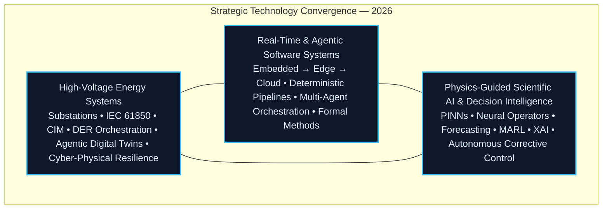

<p align="center">
  
</p>
<p align="center">
  <a href="https://vincenzo-grimaldi-portfolio.vercel.app/"></a>
  <a href="https://www.linkedin.com/in/vincenzo-ceccarelli-grimaldi-2912b42a0"></a>
  <a href="https://www.instagram.com/grimaldiengineering/"></a>
  <a href="https://x.com/Vince87Grimaldi"></a>
</p>
<p align="center">
  <strong>Architecting deterministic, physics-constrained, agentic intelligence that converts the most demanding cyber-physical systems into certifiable, adaptive, and mission-critical operational realities.</strong><br>
  <sub>High-Voltage Substations • Agentic Digital Twins • Autonomous Grid Intelligence • Real-Time Systems &amp; Formal Verification</sub>
</p>

<!-- === PRODUCTION-GRADE DEMONSTRATION === -->
<p align="center">
  
  <br>
  <sub><em>GridOS • Local‑first agentic digital twin &amp; high‑voltage telemetry operating system — 2026 production reference</em></sub>
</p>
<!-- ================================= -->

## Brand Architecture

**Developer Surface** — This GitHub profile is the precision technical interface: engineered for systems architects, control engineers, platform teams, researchers, and due-diligence stakeholders who require complete visibility into code, formal methods, architectural invariants, and implementation rigor.

**Executive Surface** — The [Immersive Portfolio](https://vincenzo-grimaldi-portfolio.vercel.app/) is the strategic narrative layer where physics-informed agentic systems, interactive digital twins, live multi-agent intelligence, and cinematic visualization communicate the same foundational thesis to executives, regulators, investors, and ecosystem partners.

**Unified thesis. Complementary interfaces. Mission-aligned.**

## Strategic Context: The 2026 Inflection Point

The global energy system has reached a decisive inflection. Grids must simultaneously integrate record renewable and inverter-based resource penetration, electrified transport and heating loads, hyperscale data-center demand, and intensifying extreme-weather events — while withstanding sophisticated hybrid cyber-physical threats and satisfying non-negotiable regulatory mandates (NIS2, Cyber Resilience Act, NERC CIP, RED III).

Legacy siloed OT systems, statistical black-box models, and purely reactive digital twins are reaching fundamental physical, operational, and certification limits. The organizations that will define the next decade are those deploying **unified, physics-constrained, agentic intelligence layers** capable of autonomous yet fully verifiable decision-making across the entire stack — from substation IEDs and edge controllers to cloud orchestration, flexibility markets, and system-wide resilience.

I architect these foundational layers.

## Technical Thesis: Physics-Constrained Agentic Intelligence — The Non-Negotiable Foundation

The most advanced agentic and autonomous systems achieve genuine operational trust and regulatory acceptance only when machine intelligence is rigorously constrained by the immutable laws of physics. In high-voltage environments, unconstrained or purely data-driven models introduce unacceptable safety, financial, and systemic risk — especially as multi-agent systems and LLM-orchestrated operations move from pilots into production.

**Core principle**: Data fidelity must be explicitly balanced against physical consistency at every inference and planning step.

**Total objective**:
```math
L_{\text{total}} = L_{\text{data}} + \lambda L_{\text{physics}}
```

**Physics residual** (enforcing known dynamics in real time):
```math
L_{\text{physics}} = \left\| \frac{\partial u}{\partial t} + \mathcal{N}[u] \right\|^2
```

This formulation — extended with neural operators, Fourier Neural Operators, and hybrid neuro-symbolic guardrails — is the bedrock of real-time, **provably consistent surrogate models** and **physics-guided multi-agent systems** deployed across GridOS and NeuralBridge. The outcome is intelligence that is not only high-performing but **certifiable, auditable, regulator-ready, and safe** for deployment in safety-critical high-voltage infrastructure under NIS2, CRA, and emerging AI Act high-risk requirements.

This same foundation powers the live **[physics-informed](https://github.com/iceccarelli/physics-informed)** public simulator — the reference implementation of cross-domain CIM–ThreMA ontology integration, Physics-Informed Neural Networks, adversarial-robust reinforcement learning security agents, and end-to-end IEEE 9-Bus cyber-physical validation from the 2025 RWTH Aachen Master Thesis.

## Layered Value Architecture

Four coherent, mutually reinforcing layers delivering a unified capability stack from silicon to strategy — purpose-built for the agentic, physics-constrained grid of 2026 and beyond.

| Layer | Platform | Strategic Capability |
|-------|----------|----------------------|
| **Embedded Control & Real-Time Layer** | RTOS + Signal Integrity | Hard real-time deterministic kernels, WCET analysis, formally verifiable bounded latency, and safety integrity level (SIL-4 / ASIL-D) functions for electrified rail protection, substation automation, and edge control |
| **Grid Operating System Layer** | GridOS | High-fidelity agentic digital-twin operating surface delivering live observability, DER coordination, closed-loop autonomous corrective control, real-time constraint resolution, and physics-informed what-if scenario engines for next-generation substations |
| **Agentic Orchestration Layer** | NeuralBridge | Deterministic middleware enabling verifiable, cryptographically auditable orchestration between human operators, LLM planners, multi-agent RL systems, and physical actuators while preserving hard real-time guarantees, runtime assurance cases, and formal verifiability |
| **Autonomous Perception & Actuation Layer** | Robot LiDAR Fusion | Real-time multi-modal sensor fusion, uncertainty-quantified perception, and safe action planning pipelines that translate raw sensor data into verifiable physical actions for autonomous inspection and maintenance robots operating in energized high-voltage environments |

## Convergence at the Frontier: Strategic Technology Domains

I operate daily at the convergence of three domains that collectively define the next generation of resilient, sovereign, and autonomous critical infrastructure.



High-voltage domain depth supplies the immutable physics constraints, regulatory reality, and operational context.  
Real-time and agentic software engineering delivers the high-assurance, verifiable execution fabric with cryptographic auditability.  
Physics-guided scientific AI injects adaptive, multi-agent intelligence — always grounded in first-principles physics, formal methods, and compliance mandates.

## Technology Ecosystem 2026: Full-Spectrum Mastery

Complete command of the convergent technology stack required to digitize, secure, autonomize, and future-proof high-voltage assets at production scale in the current regulatory and geopolitical environment.

<p align="center">
  
</p>

**Production capabilities this integrated stack delivers today:**

- **Deterministic Industrial Telemetry & Semantic Digital Thread** — Native, high-performance implementation of IEC 61850 Ed. 2.1 (MMS/GOOSE/Sampled Values/90-5/90-7), DNP3 Secure Authentication, MODBUS, MQTT Sparkplug B 3.0, OPC UA FX/PubSub, and full CIM (IEC 61968/61970) semantic modeling for unbroken digital thread continuity across OT/IT domains and cross-vendor interoperability.

- **Agentic Edge-to-Cloud Data Fabrics & Multi-Agent Orchestration** — Ultra-low-latency, high-throughput streaming architectures (Kafka, NATS JetStream, RabbitMQ), industrial time-series + graph databases (TimescaleDB, InfluxDB, Neo4j), and production-grade agentic runtimes supporting tool-augmented LLM agents, multi-agent RL coordination, and verifiable action planning for DER virtual power plants, flexibility market participation, and real-time grid services.

- **Physics-Informed Agentic Digital Twins & Real-Time Co-Simulation** — Scalable surrogate modeling with Physics-Informed Neural Networks, Fourier Neural Operators, and hybrid neuro-symbolic architectures; HELICS/OMNeT++ cyber-physical co-simulation; hardware-in-the-loop (HIL) with RTDS/Opal-RT; and immersive real-time 3D visualization (Three.js WebGPU, Unity HDRP, Unreal Engine 5 Niagara) for operator-grade what-if analysis and closed-loop autonomy.

- **Edge-Deployed Physics-Guided AI for Autonomous Grid Operations** — Real-time probabilistic forecasting with conformal prediction and uncertainty quantification, online adaptive learning under distribution shift, safety-shielded multi-agent reinforcement learning (MARL) for optimal DER dispatch and Volt/VAR/Watt optimization, automated corrective control, and explainable predictive maintenance — all optimized for ruggedized edge inference (sub-10 ms) with formal guardrails.

- **DevSecOps, Zero-Trust OT Architecture & Sovereign Compliance Automation** — GitOps with signed artifacts and policy-as-code (OPA/Kyverno), immutable infrastructure, automated SBOM + compliance evidence generation, continuous threat modeling (MITRE ATT&CK for ICS), and architectures aligned to NERC CIP, NIS2, EU Cyber Resilience Act (CRA), IEC 62351/62443 SL-4, and emerging AI Act high-risk obligations for critical infrastructure — enabling regulator-ready, audit-ready, and sovereign deployments.

## Flagship Open-Source Platforms

All flagship repositories are open source and engineered for immediate technical inspection, collaborative extension, pilot integration, and scaling into production mission-critical environments.

| Project | Focus Area | Maturity | Access |
|---------|------------|----------|--------|
| **[physics-informed](https://github.com/iceccarelli/physics-informed)** | Reference-grade interactive cyber-physical simulator implementing cross-domain CIM + ThreMA ontology integration, Physics-Informed Neural Networks, Fourier Neural Operator surrogates, adversarial-robust RL security agents, and complete IEEE 9-Bus / 39-Bus validation under N-1 contingencies and cyber-attack scenarios (core deliverable of the 2025 RWTH Aachen Master Thesis) | Live Demo | [Launch Live Simulator](https://physics-informed.vercel.app/) |
| **[NeuralBridge](https://github.com/iceccarelli/neuralbridge)** | Production-intent deterministic agentic middleware for cryptographically verifiable, runtime-assured orchestration of human operators, LLM planners, multi-agent systems, and physical actuators in safety-critical cyber-physical environments | Active Development | [View Repository](https://github.com/iceccarelli/neuralbridge) |
| **[GridOS](https://github.com/iceccarelli/GridOS)** | Next-generation substation operating system and agentic digital-twin platform delivering unified high-fidelity observability, closed-loop autonomous corrective control, DER aggregation, and real-time physics-constrained intelligence for HV/MV grids dominated by inverter-based resources | Under Active Construction | [View Repository](https://github.com/iceccarelli/GridOS) |
| **[DERIM](https://github.com/iceccarelli/derim-middleware)** | Distributed Energy Resource Intelligence Middleware with native multi-protocol modeling (IEC 61850 / DNP3), verifiable multi-agent coordination, and physics-informed optimization enabling secure participation in ancillary services, congestion management, and local flexibility markets at scale | Active Development | [View Repository](https://github.com/iceccarelli/derim-middleware) |
| **[robot-lidar-fusion](https://github.com/iceccarelli/robot-lidar-fusion)** | Real-time multi-modal LiDAR perception, sensor fusion, uncertainty quantification, and safe action planning stack purpose-built for autonomous mobile inspection and maintenance robots operating under strict EMC, safety-distance, and functional-safety constraints in live 110–400 kV environments | Active Development | [View Repository](https://github.com/iceccarelli/robot-lidar-fusion) |

**Star the repositories. Fork them. Integrate them into pilots. Deploy them in production. Shape the future of critical infrastructure with them.**

## Engineering Doctrine & Delivery Model

I deliver **resilient, explainable, formally verifiable, and regulator-auditable systems** engineered to perform without compromise under the combined physical, cyber, regulatory, and extreme-operating constraints of high-voltage transmission, distribution, and traction power networks.

- Architecture and interfaces designed from first principles around **determinism, verifiability, resilience, cryptographic auditability, and regulatory traceability**
- Exhaustive verification & validation discipline spanning model-based systems engineering, software-in-the-loop, hardware-in-the-loop (HIL), formal methods (TLA+), and runtime assurance for all safety-relevant and agentic components
- Disciplined, risk-managed incremental delivery of complete, independently testable production increments accompanied by operator-grade documentation, training packages, and control-room-ready runbooks
- Strong commitment to open standards, portable implementations, and architectures that remain viable across vendor ecosystems, technology generations, and evolving regulatory regimes

Primary implementation stack: **Python** for orchestration, data science, agent development, and rapid prototyping; **Rust** and **C++** for performance-critical deterministic real-time cores and safety functions; **FastAPI** for high-performance, type-safe, auditable services; combined with production real-time data pipelines and advanced physics-informed digital twin engines. When executive communication or operator experience requires it, fluid interfaces are delivered in **React/Next.js** or photorealistic real-time 3D via **Three.js** and **Unreal Engine 5**.

## Validated Impact & Strategic Outcomes

Selected, validated outcomes from research prototypes, pilot systems, and production-adjacent deployments — directly aligned with 2026 operational and regulatory priorities:

- **22% reduction** in renewable curtailment achieved through DERIM middleware coupled with physics-guided multi-agent reinforcement learning dispatch optimization under realistic volatility and N-1 conditions — accelerating decarbonization economics and lowering system balancing costs.
- **Sub-8 ms** deterministic end-to-end orchestration latency demonstrated in NeuralBridge agentic layers under realistic multi-agent, multi-protocol, and LLM-augmented workloads — enabling reliable participation in sub-second frequency containment, synthetic inertia, and flexibility services.
- **99.999% uptime** architectural pathway enabled by layered defense-in-depth: RTOS predictability + physics-informed runtime monitors + proactive anomaly containment + zero-trust OT patterns — aligned with IEC 62443 SL-4, NERC CIP-002/014, and NIS2 resilience expectations.
- **15–40% higher** feasible renewable hosting capacity demonstrated in validated simulation and pilot environments through real-time physics-constrained autonomous Volt/VAR/Watt optimization and closed-loop DER coordination — critical for DSO/TSO compliance with RED III targets and grid-code evolution.

## Professional Trajectory

| Role | Organization | Period | Key Focus Areas |
|------|--------------|--------|-----------------|
| **ITk Fachspezialist – Strategic Digitisation of High-Voltage Assets** | **DB InfraGO AG** | Aug 2024 – Present | Leading digitalization strategy and execution for railway traction high-voltage grids; driving IT/OT convergence and zero-trust OT architecture programs; deploying agentic digital twin platforms for predictive asset health and automated compliance evidence generation; preparing NIS2 and CRA conformity frameworks for critical infrastructure |
| **Industrial Engineering Intern – High-Voltage Maintenance** | **DB Fahrzeuginstandhaltung GmbH & DB Netz AG** | Jun 2022 – Sep 2024 | Full lifecycle management and condition-based/predictive maintenance of 16.7 Hz traction power substations; multi-modal asset condition monitoring and health analytics (PD, vibration, thermography, oil diagnostics) fused with early ML pipelines; reliability-centered maintenance strategy development under strict RAMS and EN 50126/50128/50129 frameworks |

## Standards, Regulatory Frameworks & Compliance Command

Production-grade, operational expertise in the complete standards and regulatory regimes that govern safe, secure, interoperable, and sovereign critical energy and transport infrastructure worldwide:

**IEC 61850 Ed. 2.1 (MMS/GOOSE/SV/90-x)** • **CIM (IEC 61968/61970)** • **OCPP 2.0.1** • **SunSpec** • **ROS 2** • **HELICS** • **TLA+ & Formal Methods** • **IEC 62351** • **IEC 62443 (SL-4)** • **NERC CIP** • **NIS2 Directive** • **EU Cyber Resilience Act (CRA)** • **RED III / Grid Codes**

## Linguistic Fluency

<p align="left">
  
  
  
  
</p>

## Open-Source Engineering Footprint & Momentum

<p align="center">
  
</p>
<p align="center">
  
</p>

---

**One Mission. Two Surfaces.**

This GitHub presence is the transparent, code-first, architecturally rigorous surface for technical due diligence, code review, and collaborative development.

For the complete executive briefing experience — interactive physics-informed agentic digital twin demonstrations, live multi-agent orchestration visualizers, and strategic narrative — visit:

**[https://vincenzo-grimaldi-portfolio.vercel.app/](https://vincenzo-grimaldi-portfolio.vercel.app/)**

**Vincenzo Grimaldi**

Strategic Architect of Deterministic, Physics-Constrained Agentic Intelligence for Critical Infrastructure

📍 Europe-based • Selectively open to transformative architectural, advisory, and leadership engagements in Grid Modernization, Cyber-Physical Systems Resilience, Sovereign Agentic AI, and Autonomous Infrastructure

✉️ [vincenzo@grimaldi.engineering](mailto:vincenzo@grimaldi.engineering)
