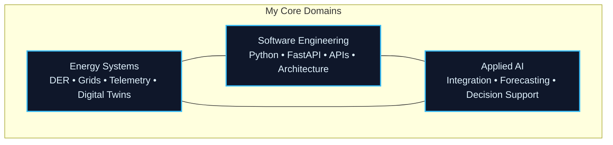

  

  
  
  

  <strong>Building practical, reliable software at the intersection of energy systems, data, and intelligent infrastructure.</strong>

<!-- === PROFESSIONAL WORK DEMO === -->

  
   
  <em>GridOS • Local-first smart-grid telemetry &amp; digital-twin platform</em>

<!-- ================================= -->

## About Me

I work at the intersection of **electrical power engineering**, **software systems**, and **applied AI**. My background is in Business Administration and Engineering at **RWTH Aachen University**, with a specialization in Electrical Power Engineering.

I believe advanced technical systems only create real value when they are understandable, testable, and usable in actual operating environments. My focus lies in cyber-physical energy systems, digital twins, operational data middleware, and software that bridges the gap between complex models and practical deployment.

## Core Focus

I build foundations and prototypes that connect three domains:

This diagram represents how I approach problems: energy systems provide the domain, software engineering delivers the structure, and applied AI adds intelligence — always grounded in operational reality.

## Selected Projects

| Project | Focus | Maturity |
|---------|-------|----------|
| **[NeuralBridge](https://github.com/iceccarelli/neuralbridge)** | Lightweight integration layer connecting AI workflows to external systems through adapters and clean APIs | Active Development |
| **[GridOS](https://github.com/iceccarelli/GridOS)** | Local-first smart-grid simulation platform for telemetry, digital twins, and operational prototyping | Under Construction |
| **[DERIM](https://github.com/iceccarelli/derim-middleware)** | Open-source middleware for integrating solar, batteries, and EV charging with practical telemetry models | Active Development |
| **[robot-lidar-fusion](https://github.com/iceccarelli/robot-lidar-fusion)** | Robotics foundation for LiDAR-camera fusion, perception, and real-time navigation | Active Development |

## How I Work

I prioritize systems that are technically sound **and** usable by real people. This means:

- Clear architecture and explicit interfaces
- Realistic documentation and sufficient testing
- Shipping smaller, complete systems rather than large, over-promised ones

My primary tools are **Python**, **FastAPI**, data pipelines, and practical application design. When a project benefits from it, I also build usable frontends with **React**.

## Professional Experience

| Role | Organization | Period | Focus |
|------|--------------|--------|-------|
| **ITk Fachspezialist** | **DB InfraGO AG** | Aug 2024 – Present | Quality governance, cybersecurity thinking, resilience, and infrastructure-focused IT/OT |
| **Industrial Engineering Intern** | **DB Fahrzeuginstandhaltung GmbH & DB Netz AG** | Jun 2022 – Sep 2024 | Asset lifecycle, maintenance engineering, and exposure to critical operational systems |

## Languages

  
  
  
  

## GitHub Activity

  

  

