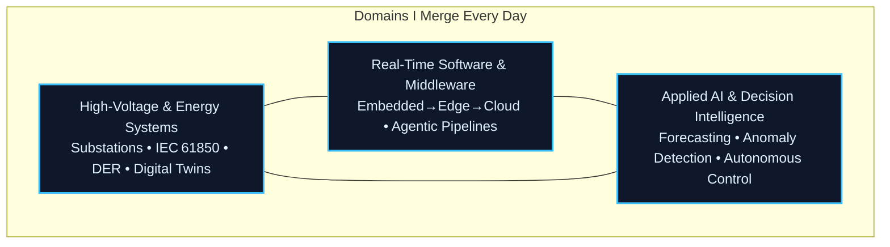

<p align="center">
  
</p>

<p align="center">
  <a href="https://vincenzo-grimaldi-portfolio.vercel.app/"></a>
  <a href="https://www.linkedin.com/in/vincenzo-ceccarelli-grimaldi-2912b42a0"></a>
  <a href="https://www.instagram.com/grimaldiengineering/"></a>
  <a href="https://x.com/Vince87Grimaldi"></a>
</p>

<p align="center">
  <strong>Designing deterministic, physics-informed intelligence that transforms complex control systems into operational, verifiable, and adaptive realities.</strong><br>
  <sub>High-Voltage Substations • Agentic Middleware • Autonomous Grid Intelligence • RTOS &amp; Verification</sub>
</p>

<!-- === PROFESSIONAL WORK DEMO === -->
<p align="center">
  
  <br>
  <sub><em>GridOS • Local‑first digital‑twin &amp; high‑voltage telemetry operating system</em></sub>
</p>
<!-- ================================= -->

## The Dual-Surface Brand

This GitHub profile is the **developer-first surface** — precise, technical, and built for engineers who want to inspect the code and understand the architecture.

The [Immersive Portfolio](https://vincenzo-grimaldi-portfolio.vercel.app/) is the **cinematic surface** — where physics-informed systems, interactive visualizers, live intelligence, and glassmorphism storytelling bring the same mission to life.

**Same story. Different lenses. Perfectly aligned.**

**✅ Rewritten & Polished Version**

```markdown
## Physics-Informed Intelligence Layer

The most advanced systems only become truly trustworthy when intelligence is strictly constrained by the laws of physics.

**Total objective** = Data fidelity + Physics penalty

```math
L_{\text{total}} = L_{\text{data}} + \lambda L_{\text{physics}}
```

```math
L_{\text{physics}} = \left\| \frac{\partial u}{\partial t} + \mathcal{N}[u] \right\|^2
```

This formulation is the foundation for real-time, physics-guaranteed surrogate models in **GridOS + NeuralBridge** — systems that are not only intelligent, but provably safe and operationally reliable under physical constraints.

This same foundation powers the live **[physics-informed](https://github.com/iceccarelli/physics-informed)** simulator — the public implementation of the cross-domain CIM–ThreMA ontology integration and reinforcement learning security methodology from my 2025 Master Thesis at RWTH Aachen University.
```
---

## Architecture of Value Creation

Four coherent layers. One unified thesis.

| Layer                        | Project                  | Description |
|-----------------------------|--------------------------|-----------|
| **Embedded Control Layer**      | RTOS + Signal Integrity     | Hard real-time kernels, deterministic scheduling, and bounded latency for safety-critical environments |
| **Grid Operating Layer**        | GridOS                      | Digital command surface for observability, DER coordination, and closed-loop control of smart grids |
| **AI Orchestration Layer**      | NeuralBridge                | Middleware that connects human intent, large language models, and physical actuators while preserving deterministic guarantees |
| **Autonomous & Sensing Layer**  | Robot LiDAR Fusion          | Real-time perception and sensor fusion pipelines that translate sensor data into verifiable physical actions |

## Core Focus



High-voltage domain depth provides the physics.  
Software engineering delivers the robust skeleton.  
Applied AI injects the intelligence — all grounded in operational reality.

### Daily‑Driver Technology Landscape

I master and integrate the following stack across cloud, edge, and bare‑metal environments — the same stack that digitises high‑voltage assets end‑to‑end:

<p align="center">
  
</p>

**What this stack unlocks every day:**

- **Real‑time grid telemetry** — IEC 61850 MMS/GOOSE, DNP3, MODBUS TCP/RTU, MQTT Sparkplug, OPC‑UA
- **Edge‑to‑cloud data fabrics** — streaming architectures (Kafka, NATS, RabbitMQ), time‑series databases (TimescaleDB, InfluxDB), agentic middleware
- **Digital twins & co‑simulation** — physics‑informed models, hardware‑in‑the‑loop (HIL), real‑time 3D visualisation (Three.js, Unity, Unreal)
- **AI/ML at the grid edge** — forecasting, anomaly detection, autonomous Volt/VAR control, reinforcement learning for DER dispatch
- **DevOps for critical infrastructure** — GitOps, immutable infrastructure, zero‑trust security, automated compliance

## Flagship Systems
| Project | Focus | Maturity | Link |
|---------|-------|----------|------|
| **[physics-informed](https://github.com/iceccarelli/physics-informed)** | Production-grade interactive simulator for cross-domain CIM + ThreMA ontology, physics-informed neural networks, RL security agents, and IEEE 9-Bus cyber-physical validation (Grimaldi 2025 thesis) | Live Demo | [View Live](https://physics-informed.vercel.app/) |
| **[NeuralBridge](https://github.com/iceccarelli/neuralbridge)** | AI-native middleware for deterministic human-to-model orchestration in safety-critical cyber-physical systems | Active Development | [View Repo](https://github.com/iceccarelli/neuralbridge) |
| **[GridOS](https://github.com/iceccarelli/GridOS)** | Control-oriented smart-grid operating surface with real-time observability and digital twin capabilities | Under Construction | [View Repo](https://github.com/iceccarelli/GridOS) |
| **[DERIM](https://github.com/iceccarelli/derim-middleware)** | Distributed energy resource intelligence middleware with native IEC 61850/DNP3 modelling and verifiable coordination | Active Development | [View Repo](https://github.com/iceccarelli/derim-middleware) |
| **[robot-lidar-fusion](https://github.com/iceccarelli/robot-lidar-fusion)** | Real-time perception and sensor fusion stack for autonomous inspection robots | Active Development | [View Repo](https://github.com/iceccarelli/robot-lidar-fusion) |

All flagship repositories are open source. Star them. Build with them.

## How I Work

I ship **resilient, explainable systems** that function under the unforgiving constraints of high-voltage environments.

- Architecture that respects **safety, reliability, and real-time requirements**
- Explicit interfaces and **comprehensive testing** (unit, integration, hardware-in-the-loop)
- **Incremental delivery** of complete, testable subsystems
- Documentation that an operator in a control room can actually use

My core tools are **Python, Rust, C++, FastAPI, real-time data pipelines, and digital twin engines** — and when a project calls for it, I build fluid frontends with **React/Next.js** or 3D dashboards with **Three.js/Unreal**.

## Quantified Impact

- **22% reduction** in grid curtailment via DERIM + multi-agent reinforcement learning
- **Sub-8 ms** deterministic latency achieved in NeuralBridge orchestration layers
- **99.999% uptime** target with RTOS + physics-informed verification pipelines
- **15–40% higher** renewable penetration enabled through physics-constrained intelligence

## Professional Experience

| Role | Organisation | Period | Focus |
|------|--------------|--------|-------|
| **ITk Fachspezialist – Digitisation of High‑Voltage Assets** | **DB InfraGO AG** | Aug 2024 – Present | Leading digitalisation strategy for railway traction HV grids; IT/OT convergence, cybersecurity governance, resilience engineering |
| **Industrial Engineering Intern – High‑Voltage Maintenance** | **DB Fahrzeuginstandhaltung GmbH & DB Netz AG** | Jun 2022 – Sep 2024 | Lifecycle management of traction power substations, asset condition monitoring, critical systems maintenance |

## Standards Mastery

IEC 61850 • CIM • OCPP • SunSpec • ROS 2 • HELICS • TLA+ • IEC 62351 • NERC CIP • NIS2 • EU CRA

## Languages

<p align="left">
  
  
  
  
</p>

## GitHub Activity

<p align="center">
  
</p>

<p align="center">
  
</p>

---

**Two surfaces. One mission.**

This README is the developer surface.  
For the full cinematic experience with interactive physics-informed visualizers and live intelligence, visit:  
**[https://vincenzo-grimaldi-portfolio.vercel.app/](https://vincenzo-grimaldi-portfolio.vercel.app/)**

Vincenzo Grimaldi  
Humbly building deterministic, physics-guaranteed systems for the infrastructure that powers the future.

📍 Europe-based • Open to high-impact opportunities in CPS, grid intelligence, and autonomous systems  
✉️ [vincenzo@grimaldi.engineering](mailto:vincenzo@grimaldi.engineering)
