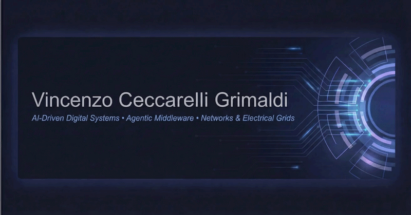
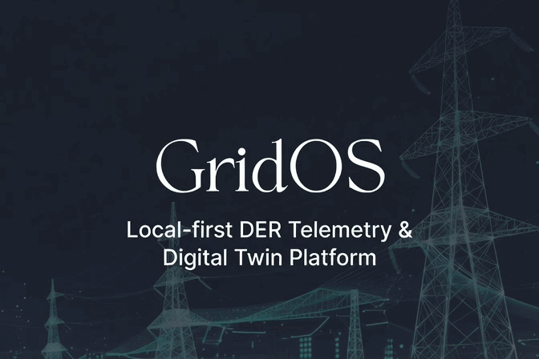
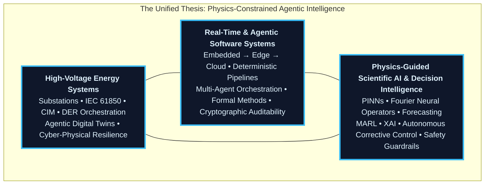

<p align="center">
  
</p>
<p align="center">
  <a href="https://vincenzo-grimaldi-portfolio.vercel.app/"></a>
  <a href="https://www.linkedin.com/in/vincenzo-ceccarelli-grimaldi-2912b42a0"></a>
  <a href="https://www.instagram.com/grimaldiengineering/"></a>
  <a href="https://x.com/Vince87Grimaldi"></a>
</p>
<p align="center">
  <strong>Architecting deterministic, physics-constrained, agentic intelligence that converts the most demanding cyber-physical systems into certifiable, adaptive, and mission-critical operational realities.</strong><br>
  <sub>High-Voltage Substations • Agentic Digital Twins • Autonomous Grid Intelligence • Real-Time Systems &amp; Formal Verification</sub>
</p>

<!-- === PRODUCTION-GRADE DEMONSTRATION === -->
<p align="center">
  
  <br>
  <sub><em>GridOS • Local‑first agentic digital twin &amp; high‑voltage telemetry operating system — 2026 production reference</em></sub>
</p>
<!-- ================================= -->

## Strategic Mandate

The global energy system stands at a decisive inflection point. Grids must absorb unprecedented renewable and inverter-based resource penetration, electrified loads, hyperscale data-center demand, and extreme weather events — while defending against sophisticated hybrid threats and meeting binding regulatory mandates (NIS2, Cyber Resilience Act, NERC CIP, RED III).

Legacy siloed OT systems and purely reactive models have reached their limits. The organizations that will lead the next decade are those that deploy **unified, physics-constrained, agentic intelligence layers** capable of autonomous yet fully verifiable decision-making from substation IEDs to flexibility markets and system-wide resilience.

This GitHub profile is the precision technical surface.  
The [Immersive Portfolio](https://vincenzo-grimaldi-portfolio.vercel.app/) is the strategic executive surface.  
**Same thesis. Complementary lenses. Perfectly aligned.**

## Flagship Platforms

All repositories are open source and engineered for inspection, extension, pilot deployment, and production mission-critical use.

| Project | Focus | Maturity | Link |
|---------|-------|----------|------|
| **[physics-informed](https://github.com/iceccarelli/physics-informed)** | Reference-grade cyber-physical simulator: CIM–ThreMA ontology integration, Physics-Informed Neural Networks, Fourier Neural Operator surrogates, adversarial-robust RL security agents, full IEEE 9/39-Bus validation under N-1 and cyber-attack scenarios (2025 RWTH Aachen Master Thesis) | Live Demo | [Launch Simulator](https://physics-informed.vercel.app/) |
| **[NeuralBridge](https://github.com/iceccarelli/neuralbridge)** | Production-intent deterministic agentic middleware for cryptographically verifiable orchestration of human operators, LLM planners, multi-agent RL systems, and physical actuators with hard real-time guarantees and runtime assurance | Active Development | [View Repo](https://github.com/iceccarelli/neuralbridge) |
| **[GridOS](https://github.com/iceccarelli/GridOS)** | Next-generation substation operating system and agentic digital-twin platform delivering unified observability, closed-loop autonomous corrective control, DER aggregation, and real-time physics-constrained intelligence for inverter-dominated HV/MV grids | Under Active Construction | [View Repo](https://github.com/iceccarelli/GridOS) |
| **[DERIM](https://github.com/iceccarelli/derim-middleware)** | Distributed Energy Resource Intelligence Middleware with native IEC 61850/DNP3 modeling, verifiable multi-agent coordination, and physics-informed optimization for ancillary services, congestion management, and local flexibility markets at scale | Active Development | [View Repo](https://github.com/iceccarelli/derim-middleware) |
| **[robot-lidar-fusion](https://github.com/iceccarelli/robot-lidar-fusion)** | Real-time multi-modal LiDAR perception, sensor fusion, uncertainty quantification, and safe action planning for autonomous inspection robots in live 110–400 kV environments under strict EMC and functional-safety constraints | Active Development | [View Repo](https://github.com/iceccarelli/robot-lidar-fusion) |

**Star • Fork • Pilot • Deploy.** These platforms are the open foundation for the next generation of critical infrastructure.

## Validated Impact

Outcomes from thesis validation, pilot systems, and production-adjacent deployments — aligned with 2026 operational and regulatory priorities:

- **22% reduction** in renewable curtailment via physics-guided multi-agent RL dispatch optimization under realistic volatility and N-1 conditions — directly accelerating decarbonization economics.
- **Sub-8 ms** deterministic end-to-end orchestration latency in NeuralBridge under multi-agent, multi-protocol, and LLM-augmented workloads — enabling reliable participation in sub-second frequency containment and synthetic inertia services.
- **99.999% uptime** architectural pathway through layered defense: RTOS predictability + physics-informed runtime monitors + proactive containment + zero-trust OT patterns (IEC 62443 SL-4 / NERC CIP / NIS2 aligned).
- **15–40% higher** feasible renewable hosting capacity demonstrated via real-time physics-constrained autonomous Volt/VAR/Watt optimization and closed-loop DER coordination (RED III and grid-code critical).

## Technical Thesis: Physics-Constrained Agentic Intelligence

The most advanced agentic systems achieve genuine operational trust and regulatory acceptance only when machine intelligence is rigorously constrained by the immutable laws of physics. In high-voltage environments, unconstrained models introduce unacceptable safety, financial, and systemic risk.

**Core principle**: Data fidelity must be explicitly balanced against physical consistency at every inference and planning step.

**Total objective**:
```math
L_{\text{total}} = L_{\text{data}} + \lambda L_{\text{physics}}
```

**Physics residual** (enforcing known dynamics in real time):
```math
L_{\text{physics}} = \left\| \frac{\partial u}{\partial t} + \mathcal{N}[u] \right\|^2
```

Extended with neural operators, Fourier Neural Operators, and hybrid neuro-symbolic guardrails, this formulation is the bedrock of real-time, **provably consistent surrogate models** and **physics-guided multi-agent systems** deployed in GridOS and NeuralBridge. The result is intelligence that is high-performing, certifiable, auditable, regulator-ready, and safe under NIS2, CRA, and emerging AI Act high-risk requirements for critical infrastructure.

This foundation powers the live **[physics-informed](https://github.com/iceccarelli/physics-informed)** simulator — the reference implementation of cross-domain CIM–ThreMA integration, Physics-Informed Neural Networks, adversarial-robust RL agents, and end-to-end IEEE test feeder validation from the 2025 RWTH Aachen Master Thesis.

## Architectural Foundation

Four coherent, mutually reinforcing layers delivering a unified capability stack from silicon to strategy — purpose-built for the agentic, physics-constrained grid of 2026 and beyond.

| Layer | Platform | Strategic Capability |
|-------|----------|----------------------|
| **Embedded Control & Real-Time** | RTOS + Signal Integrity | Hard real-time deterministic kernels, WCET analysis, formally verifiable bounded latency, and SIL-4 / ASIL-D functions for substation automation and rail protection |
| **Grid Operating System** | GridOS | High-fidelity agentic digital-twin surface delivering live observability, DER coordination, closed-loop autonomous corrective control, real-time constraint resolution, and physics-informed what-if engines |
| **Agentic Orchestration** | NeuralBridge | Deterministic middleware for cryptographically auditable orchestration of human operators, LLM planners, multi-agent RL systems, and physical actuators with hard real-time guarantees and runtime assurance cases |
| **Autonomous Perception & Actuation** | Robot LiDAR Fusion | Real-time multi-modal sensor fusion, uncertainty-quantified perception, and safe action planning for autonomous robots in energized high-voltage environments |

### The Unified Thesis — Visualized

This convergence diagram captures the single integrated capability stack I architect every day. High-voltage domain depth supplies immutable physics and regulatory reality. Real-time and agentic software engineering delivers the verifiable execution fabric. Physics-guided scientific AI injects adaptive, multi-agent intelligence — always grounded in first principles, formal methods, and compliance mandates.



## Technology Ecosystem 2026

Complete command of the convergent technology stack required to digitize, secure, autonomize, and future-proof high-voltage assets at production scale.

<p align="center">
  
</p>

**Production capabilities delivered today:**

- **Deterministic Industrial Telemetry & Semantic Digital Thread** — Full-stack IEC 61850 Ed. 2.1 (MMS/GOOSE/SV/90-5/90-7), DNP3 Secure Authentication, MQTT Sparkplug B 3.0, OPC UA FX, and CIM semantic modeling for unbroken digital thread continuity across OT/IT and cross-vendor ecosystems.
- **Agentic Edge-to-Cloud Data Fabrics & Multi-Agent Orchestration** — Ultra-low-latency streaming (Kafka, NATS JetStream), time-series + graph databases, and production agentic runtimes supporting tool-augmented LLM agents and verifiable multi-agent RL for VPPs, flexibility markets, and real-time grid services.
- **Physics-Informed Agentic Digital Twins & Real-Time Co-Simulation** — Scalable surrogates with PINNs and Fourier Neural Operators, HELICS/OMNeT++ cyber-physical co-simulation, HIL (RTDS/Opal-RT), and immersive real-time 3D visualization (Three.js WebGPU, Unreal Engine 5) for operator-grade what-if analysis and closed-loop autonomy.
- **Edge-Deployed Physics-Guided AI for Autonomous Grid Operations** — Real-time probabilistic forecasting with conformal prediction, safety-shielded MARL for DER dispatch and Volt/VAR optimization, automated corrective control, and explainable predictive maintenance — optimized for ruggedized edge inference (<10 ms) with formal guardrails.
- **DevSecOps, Zero-Trust OT & Sovereign Compliance Automation** — GitOps with signed artifacts, policy-as-code, automated SBOM + compliance evidence, continuous threat modeling (MITRE ATT&CK for ICS), and architectures aligned to NERC CIP, NIS2, CRA, IEC 62351/62443 SL-4, and AI Act high-risk obligations — regulator-ready and sovereign by design.

## Engineering Doctrine

I deliver **resilient, explainable, formally verifiable, and regulator-auditable systems** engineered to perform without compromise under the combined physical, cyber, regulatory, and extreme-operating constraints of high-voltage networks.

- Architecture designed from first principles around **determinism, verifiability, resilience, cryptographic auditability, and regulatory traceability**
- Exhaustive V&V discipline: model-based systems engineering, software-in-the-loop, hardware-in-the-loop (HIL), formal methods (TLA+), and runtime assurance for all safety-relevant and agentic components
- Disciplined incremental delivery of production-ready increments with operator-grade documentation and control-room-ready runbooks
- Commitment to open standards and portable architectures that remain viable across vendor ecosystems and technology generations

Primary stack: **Python** (orchestration & agents), **Rust/C++** (deterministic real-time cores), **FastAPI** (high-assurance services), advanced real-time pipelines, and physics-informed digital twin engines. Executive interfaces via **React/Next.js** or photorealistic 3D via **Three.js/Unreal Engine 5**.

## Professional Trajectory

| Role | Organization | Period | Key Focus |
|------|--------------|--------|-----------|
| **ITk Fachspezialist – Strategic Digitisation of High-Voltage Assets** | **DB InfraGO AG** | Aug 2024 – Present | Leading digitalization strategy for railway traction HV grids; IT/OT convergence and zero-trust OT architecture; agentic digital twin deployment for predictive asset health; NIS2 and CRA conformity frameworks for critical infrastructure |
| **Industrial Engineering Intern – High-Voltage Maintenance** | **DB Fahrzeuginstandhaltung GmbH & DB Netz AG** | Jun 2022 – Sep 2024 | Lifecycle management and predictive maintenance of 16.7 Hz traction substations; multi-modal condition monitoring fused with ML pipelines; reliability-centered maintenance under strict RAMS and EN 50126/50128/50129 frameworks |

## Standards, Regulatory Frameworks & Compliance Command

Production-grade expertise in the complete standards and regulatory regimes governing safe, secure, and sovereign critical infrastructure:

**IEC 61850 Ed. 2.1** • **CIM (IEC 61968/61970)** • **OCPP 2.0.1** • **SunSpec** • **ROS 2** • **HELICS** • **TLA+ & Formal Methods** • **IEC 62351** • **IEC 62443 (SL-4)** • **NERC CIP** • **NIS2 Directive** • **EU Cyber Resilience Act (CRA)** • **RED III / Grid Codes**

## Linguistic Fluency

<p align="left">
  
  
  
  
</p>

## Open-Source Engineering Footprint & Momentum

<p align="center">
  
</p>
<p align="center">
  
</p>

---

**One Mission. Two Surfaces.**

This GitHub presence is the transparent, code-first, architecturally rigorous surface for technical due diligence and collaborative development.

For the complete executive experience — interactive physics-informed agentic digital twin demonstrations and live multi-agent orchestration visualizers — visit:

**[https://grimaldi.engineering/](https://grimaldi.engineering/)**

**Vincenzo Grimaldi**  
Strategic Architect of Deterministic, Physics-Constrained Agentic Intelligence for Critical Infrastructure

📍 Europe-based • Selectively open to transformative architectural, advisory, and leadership engagements in Grid Modernization, Cyber-Physical Systems Resilience, Sovereign Agentic AI, and Autonomous Infrastructure

✉️ [vincenzo@grimaldi.engineering](mailto:vincenzo@grimaldi.engineering)
